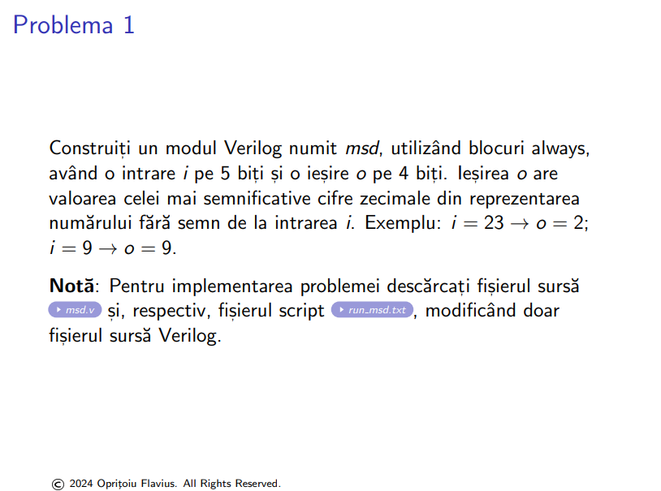
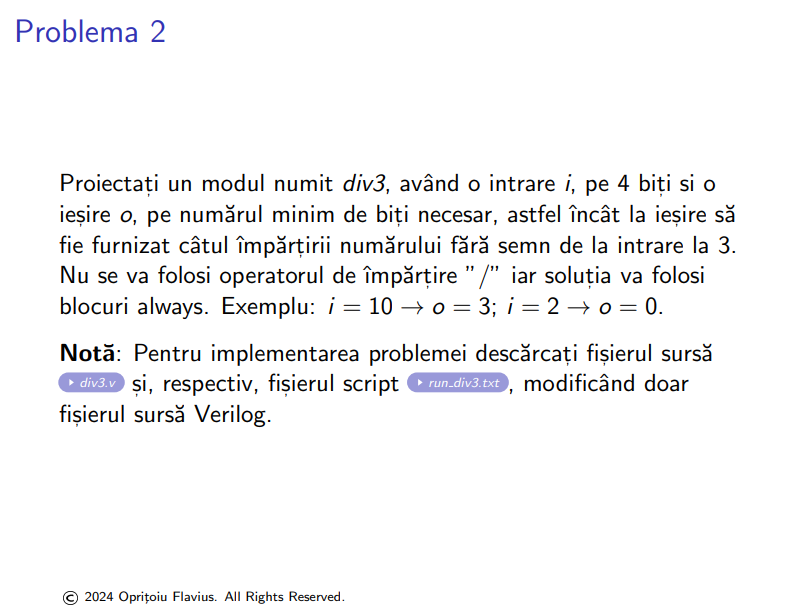
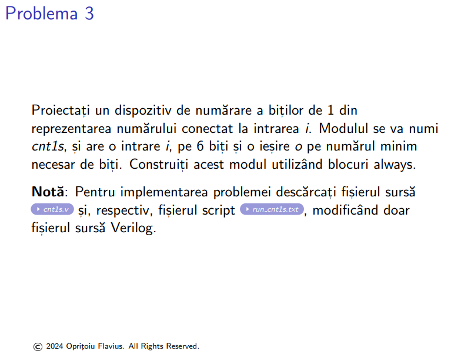
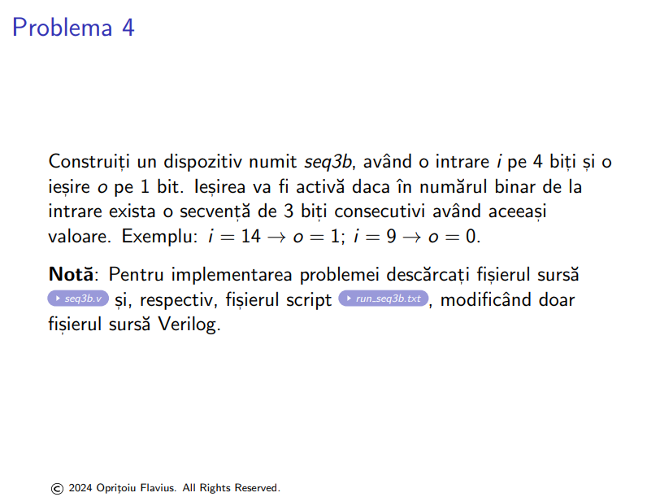
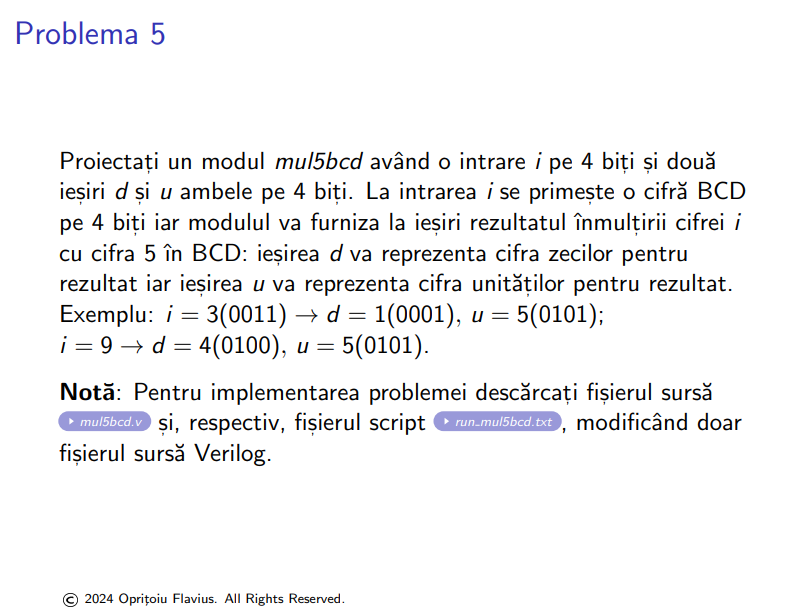
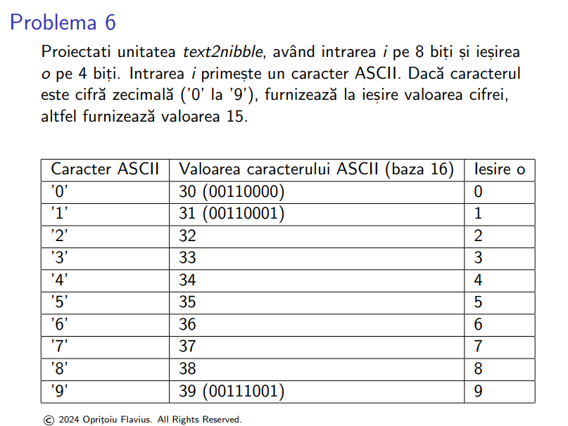

1. 

- ``msd.v``
```verilog
module msd (
  input [4:0] i,
  output reg [3:0] o
);
  always @(*) begin
    o = i/10;
  end
endmodule


module msd_tb;
	reg [4:0] i;
	wire [3:0] o;
	
	msd msd_i (.i(i), .o(o));
	
	integer k;
	initial begin
	$display("Time\ti\t\to");
	$monitor("%0t\t%b(%2d)\t%b(%0d)", $time, i, i, o, o);
	i = 0;
	for (k = 1; k < 32; k = k + 1)
	  #10 i = k;
	end
endmodule
```


- ``run_msd.txt`` (run with ``do run_msd.txt`` inside ``modelsim`` console)
```tcl
# add all Verilog source files, separated by spaces
set sourcefiles {msd.v}

# set name of the top module
set topmodule msd_tb

###################################################
#####DO NOT MODIFY THE SCRIPT BELLOW THIS LINE#####
###################################################

# quit current simulation if any
quit -sim

# empty the work library if present
if [file exists "work"] {vdel -all}
#create a new work library
vlib work

# run the compiler
if [catch "eval vlog $sourcefiles"] {
    puts "correct the compilation errors"
    return
}

vsim -voptargs=+acc $topmodule

run -all
quit -sim
```

2. 

- ``div3.v``
```verilog
module div3 (
  input [3:0] i,
  output reg [2:0] o
);

	always @(*) begin
	o = (i == 0) ? 0 :
			 (i == 1) ? 0 :
			 (i == 2) ? 0 :
			 (i == 3) ? 1 :
			 (i == 4) ? 1 :
			 (i == 5) ? 1 :
			 (i == 6) ? 2 :
			 (i == 7) ? 2 :
			 (i == 8) ? 2 :
			 (i == 9) ? 3 :
			 (i == 10) ? 3 :
			 (i == 11) ? 3 :
			 (i == 12) ? 4 :
			 (i == 13) ? 4 :
			 (i == 14) ? 4 :
						 5;
	end
endmodule

  
module div3_tb;
	reg [3:0] i;
	wire [2:0] o;
	
	div3 div3_i (.i(i), .o(o));
	
	integer k;
	initial begin
	$display("Time\ti\t\to");
	$monitor("%0t\t%b(%2d)\t%b(%0d)", $time, i, i, o, o);
	i = 0;
	for (k = 1; k < 16; k = k + 1)
	  #10 i = k;
	end
endmodule
```

- ``run_div3.txt``
```tcl
# add all Verilog source files, separated by spaces
set sourcefiles {div3.v}

# set name of the top module
set topmodule div3_tb

###################################################
#####DO NOT MODIFY THE SCRIPT BELLOW THIS LINE#####
###################################################

# quit current simulation if any
quit -sim

# empty the work library if present
if [file exists "work"] {vdel -all}
#create a new work library
vlib work

# run the compiler
if [catch "eval vlog $sourcefiles"] {
    puts "correct the compilation errors"
    return
}

vsim -voptargs=+acc $topmodule

run -all
quit -sim
```

3. 

- ``cnt1s.v``
```verilog
module cnt1s (
  input [5:0] i,
  output reg [2:0] o
);
	integer k;
	integer tmp;
	always @(*) begin
	  tmp = i;
	  o=0;
	  for(k=1;k<7;k=k+1) begin
	    if(tmp%2==1)
	      o = o+1;
	    tmp = tmp/2;
	  end
	end
endmodule

module cnt1s_tb;
	reg [5:0] i;
	wire [2:0] o;
	
	cnt1s cnt1s_i (.i(i), .o(o));
	
	integer k;
	initial begin
	$display("Time\ti\t\to");
	$monitor("%0t\t%b(%2d)\t%b(%0d)", $time, i, i, o, o);
	i = 0;
	for (k = 1; k < 64; k = k + 1)
	  #10 i = k;
	end
endmodule
```

4. 

- ``seq3b.v``
```verilog
module seq3b (
  input [3:0] i,
  output reg o
);
	always @(*) begin
	  o = (i[3:1] == 3'b111) || (i[3:1] == 3'b000) || (i[2:0] == 3'b111) || (i[2:0] == 3'b000);
	end
endmodule

module seq3b_tb;
	reg [3:0] i;
	wire o;
	
	seq3b seq3b_i (.i(i), .o(o));
	
	integer k;
	initial begin
	$display("Time\ti\t\to");
	$monitor("%0t\t%b(%2d)\t%b", $time, i, i, o);
	i = 0;
	for (k = 1; k < 16; k = k + 1)
	  #10 i = k;
	end
endmodule
```

- ``run_seq3b.v``
```tcl

# add all Verilog source files, separated by spaces
set sourcefiles {seq3b.v}

# set name of the top module
set topmodule seq3b_tb

###################################################
#####DO NOT MODIFY THE SCRIPT BELLOW THIS LINE#####
###################################################

# quit current simulation if any
quit -sim

# empty the work library if present
if [file exists "work"] {vdel -all}
#create a new work library
vlib work

# run the compiler
if [catch "eval vlog $sourcefiles"] {
    puts "correct the compilation errors"
    return
}

vsim -voptargs=+acc $topmodule

run -all
quit -sim
```

5. 


- ``mul5bcd.v``
```verilog
module mul5bcd (
  input [3:0] i,
  output reg [3:0] d, u
);
	always @(*) begin 
		d = (i*5)/10;
		u = (i*5)%10;
	end
endmodule

module mul5bcd_tb;
  reg [3:0] i;
  wire [3:0] d, u;

	mul5bcd mul5bcd_i (.i(i), .d(d), .u(u));
	
	integer k;
	initial begin
	$display("Time\ti\t\td\t\tu");
	$monitor("%0t\t%b(%4d)\t%b(%4d)\t%b(%4d)", $time, i, i, d, d, u, u);
	i = 0;
	for (k = 1; k < 10; k = k + 1)
	  #10 i = k;
	end
endmodule
```

- ``run_5bcd.txt``
```tcl
# add all Verilog source files, separated by spaces
set sourcefiles {mul5bcd.v}

# set name of the top module
set topmodule mul5bcd_tb

###################################################
#####DO NOT MODIFY THE SCRIPT BELLOW THIS LINE#####
###################################################

# quit current simulation if any
quit -sim

# empty the work library if present
if [file exists "work"] {vdel -all}
#create a new work library
vlib work

# run the compiler
if [catch "eval vlog $sourcefiles"] {
    puts "correct the compilation errors"
    return
}

vsim -voptargs=+acc $topmodule

run -all
quit -sim
```

6. 

- ``text2nibble.v``
```verilog
module text2nibble (
  input [7:0] i,
  output reg [3:0] o
);
  always @(*) begin
    o = (i >= 8'h30 && i <= 8'h39) ? i - 8'h30 : 4'hF;
  end
endmodule

module text2nibble_tb;
  reg [7:0] i;
  wire [3:0] o;

  text2nibble text2nibble_i (.i(i), .o(o));

  integer k;
  initial begin
    $display("Time\ti\ti_chr\to");
    $monitor("%0t\t%b\t%c\t%b(%d)", $time, i, i, o, o);
    i = 0;
    for (k = 1; k < 256; k = k + 1)
      #10 i = k;
  end
endmodule
```

- ``run_text2nibble.v``
```tcl

# add all Verilog source files, separated by spaces
set sourcefiles {text2nibble.v}

# set name of the top module
set topmodule text2nibble_tb

###################################################
#####DO NOT MODIFY THE SCRIPT BELLOW THIS LINE#####
###################################################

# quit current simulation if any
quit -sim

# empty the work library if present
if [file exists "work"] {vdel -all}
#create a new work library
vlib work

# run the compiler
if [catch "eval vlog $sourcefiles"] {
    puts "correct the compilation errors"
    return
}

vsim -voptargs=+acc $topmodule

run -all
quit -sim
```
