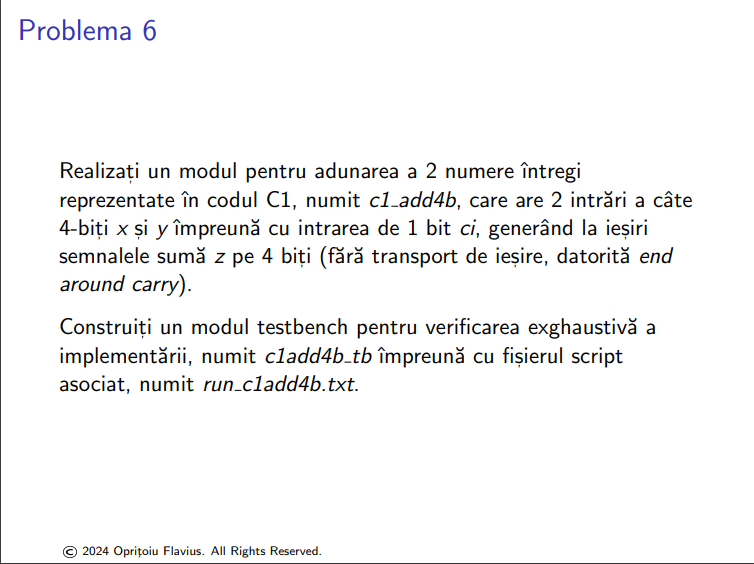

- ``fac.v``
```verilog
module fac (
    input x,    // Intrarea x
    input y,    // Intrarea y
    input ci,   // Carry in
    output z,   // Suma
    output co   // Carry out
);

    assign z = x ^ y ^ ci;

    assign co = (x & y) | (x & ci) | (y & ci);

endmodule

module fac_tb;
    reg x, y, ci;
    wire z, co;

    fac uut (
        .x(x),
        .y(y),
        .ci(ci),
        .z(z),
        .co(co)
    );

    initial begin
        $monitor("x=%b, y=%b, ci=%b -> z=%b, co=%b", x, y, ci, z, co);

        x = 0; y = 0; ci = 0;
        #10; 

        x = 0; y = 0; ci = 1;
        #10;

        x = 0; y = 1; ci = 0;
        #10;

        x = 0; y = 1; ci = 1;
        #10;

        x = 1; y = 0; ci = 0;
        #10;

        x = 1; y = 0; ci = 1;
        #10;

        x = 1; y = 1; ci = 0;
        #10;

        x = 1; y = 1; ci = 1;
        #10;

    end
endmodule

```

- ``run_fac.txt``
```tcl
# add all Verilog source files, separated by spaces
set sourcefiles {fac.v}

# set name of the top module
set topmodule fac_tb

###################################################
#####DO NOT MODIFY THE SCRIPT BELLOW THIS LINE#####
###################################################

# quit current simulation if any
quit -sim

# empty the work library if present
if [file exists "work"] {vdel -all}
#create a new work library
vlib work

# run the compiler
if [catch "eval vlog $sourcefiles"] {
    puts "correct the compilation errors"
    return
}

vsim -voptargs=+acc $topmodule

run -all
quit -sim

```


- ``add2b.v``
```verilog
module add2b (
    input [1:0] x,
    input [1:0] y,
    input ci,
    output [1:0] o,
    output co
);

    wire c1;

    fac fa0 (
        .x(x[0]),
        .y(y[0]),
        .ci(ci),
        .z(o[0]),
        .co(c1)
    );

    fac fa1 (
        .x(x[1]),
        .y(y[1]),
        .ci(c1),
        .z(o[1]),
        .co(co)
    );

endmodule
module add2b_tb;

    reg [1:0] x, y;
    reg ci;
    wire [1:0] o;
    wire co;

    add2b uut (
        .x(x),
        .y(y),
        .ci(ci),
        .o(o),
        .co(co)
    );

    initial begin
        $monitor("x=%b, y=%b, ci=%b -> o=%b, co=%b", x, y, ci, o, co);

        // carry = 0
        x = 2'b00; y = 2'b00; ci = 1'b0; #10;
        x = 2'b00; y = 2'b01; ci = 1'b0; #10;
        x = 2'b00; y = 2'b10; ci = 1'b0; #10;
        x = 2'b00; y = 2'b11; ci = 1'b0; #10;
        x = 2'b01; y = 2'b00; ci = 1'b0; #10;
        x = 2'b01; y = 2'b01; ci = 1'b0; #10;
        x = 2'b01; y = 2'b10; ci = 1'b0; #10;
        x = 2'b01; y = 2'b11; ci = 1'b0; #10;
        x = 2'b10; y = 2'b00; ci = 1'b0; #10;
        x = 2'b10; y = 2'b01; ci = 1'b0; #10;
        x = 2'b10; y = 2'b10; ci = 1'b0; #10;
        x = 2'b10; y = 2'b11; ci = 1'b0; #10;
        x = 2'b11; y = 2'b00; ci = 1'b0; #10;
        x = 2'b11; y = 2'b01; ci = 1'b0; #10;
        x = 2'b11; y = 2'b10; ci = 1'b0; #10;
        x = 2'b11; y = 2'b11; ci = 1'b0; #10;

        // carry = 1
        x = 2'b00; y = 2'b00; ci = 1'b1; #10;
        x = 2'b00; y = 2'b01; ci = 1'b1; #10;
        x = 2'b00; y = 2'b10; ci = 1'b1; #10;
        x = 2'b00; y = 2'b11; ci = 1'b1; #10;
        x = 2'b01; y = 2'b00; ci = 1'b1; #10;
        x = 2'b01; y = 2'b01; ci = 1'b1; #10;
        x = 2'b01; y = 2'b10; ci = 1'b1; #10;
        x = 2'b01; y = 2'b11; ci = 1'b1; #10;
        x = 2'b10; y = 2'b00; ci = 1'b1; #10;
        x = 2'b10; y = 2'b01; ci = 1'b1; #10;
        x = 2'b10; y = 2'b10; ci = 1'b1; #10;
        x = 2'b10; y = 2'b11; ci = 1'b1; #10;
        x = 2'b11; y = 2'b00; ci = 1'b1; #10;
        x = 2'b11; y = 2'b01; ci = 1'b1; #10;
        x = 2'b11; y = 2'b10; ci = 1'b1; #10;
        x = 2'b11; y = 2'b11; ci = 1'b1; #10;

    end

endmodule
```

- ``run_add2b.txt``
```tcl

# add all Verilog source files, separated by spaces
set sourcefiles {add2b.v fac.v}

# set name of the top module
set topmodule add2b_tb

###################################################
#####DO NOT MODIFY THE SCRIPT BELLOW THIS LINE#####
###################################################

# quit current simulation if any
quit -sim

# empty the work library if present
if [file exists "work"] {vdel -all}
#create a new work library
vlib work

# run the compiler
if [catch "eval vlog $sourcefiles"] {
    puts "correct the compilation errors"
    return
}

vsim -voptargs=+acc $topmodule

run -all
quit -sim

```


- ``cmp2b.v``
```verilog
module cmp2b(
  input [1:0] x,
  input [1:0] y,
  output eq,
  output lt,
  output gt
);
  assign eq = x == y;
  assign lt = x < y;
  assign gt = x > y;
  
endmodule

module cmp2b_tb;
  reg [1:0] x, y;
  wire eq, lt, gt;
  
  cmp2b uut(
    .x(x),
    .y(y),
    .eq(eq),
    .lt(lt),
    .gt(gt)
  );
  
  initial begin
    $monitor("x=%b, y=%b -> lt=%b, eq=%b, gt=%b", x, y, lt, eq, gt);
    x=2'b00; y=2'b00; #10;
    x=2'b01; y=2'b00; #10;
    x=2'b01; y=2'b01; #10;
    x=2'b01; y=2'b10; #10;
  end
endmodule
```

- ``run_cmp2.txt``
```tcl

# add all Verilog source files, separated by spaces
set sourcefiles {cmp2b.v}

# set name of the top module
set topmodule cmp2b_tb

###################################################
#####DO NOT MODIFY THE SCRIPT BELLOW THIS LINE#####
###################################################

# quit current simulation if any
quit -sim

# empty the work library if present
if [file exists "work"] {vdel -all}
#create a new work library
vlib work

# run the compiler
if [catch "eval vlog $sourcefiles"] {
    puts "correct the compilation errors"
    return
}

vsim -voptargs=+acc $topmodule

run -all
quit -sim

```


- ``cmp4b.v``
```verilog
module cmp4b(
    input [3:0] x,
    input [3:0] y,
    output reg eq, 
    output reg lt, 
    output reg gt
);
    wire eq1, lt1, gt1, eq2, lt2, gt2;

    cmp2b cmp0(
        .x(x[3:2]), 
        .y(y[3:2]), 
        .eq(eq1), 
        .lt(lt1), 
        .gt(gt1)
    );
    cmp2b cmp1(
        .x(x[1:0]), 
        .y(y[1:0]), 
        .eq(eq2), 
        .lt(lt2), 
        .gt(gt2)
    );

    always @(*) begin
        if (eq1 && eq2) begin
            eq = 1;
            lt = 0;
            gt = 0;
        end else begin
            eq = 0;
            if (eq1 && lt2) begin
                lt = 1;
                gt = 0;
            end else if (eq1 && gt2) begin
                lt = 0;
                gt = 1;
            end else if (lt1) begin
                lt = 1;
                gt = 0;
            end else if (gt1) begin
                lt = 0;
                gt = 1;
            end
        end
    end

endmodule
```

- ``run_cmp4b.txt``
```tcl

# add all Verilog source files, separated by spaces
set sourcefiles {cmp4b.v cmp2b.v}

# set name of the top module
set topmodule cmp4b_tb

###################################################
#####DO NOT MODIFY THE SCRIPT BELLOW THIS LINE#####
###################################################

# quit current simulation if any
quit -sim

# empty the work library if present
if [file exists "work"] {vdel -all}
#create a new work library
vlib work

# run the compiler
if [catch "eval vlog $sourcefiles"] {
    puts "correct the compilation errors"
    return
}

vsim -voptargs=+acc $topmodule

run -all
quit -sim

```


- ``c1_add4b.v``
```verilog
// Modul aditional, de adunare a doua numere pe 4 biti
module add4b (
    input [3:0] x, y, input ci,
    output [3:0] z, output co
);
    wire c2;
    add2b inst1 (.x(x[1:0]), .y(y[1:0]), .ci(ci), .co(c2), .z(z[1:0]));
    add2b inst2 (.x(x[3:2]), .y(y[3:2]), .ci(c2), .co(co), .z(z[3:2]));
endmodule

// Modul de adunare a doua numere in C1 pe 4 biti
module c1_add4b (
    input [3:0] x, y, input ci,
    output [3:0] z
);
    // Semnal pentru rezultatul intermediar al adunarii intre x si y
    wire [3:0] temp; 
    // Semnal pentru end around carry, de adunat rezultatului intermediar
    wire co;
    add4b inst1 (.x(x), .y(y), .ci(ci), .co(co), .z(temp));
    add4b inst2 (.x(temp), .y(4'd0), .ci(co), .co(), .z(z));
endmodule

module c1add4b_tb;
    reg [3:0] x, y; reg ci;
    wire [3:0] z; wire co;

    c1_add4b cut (.x(x), .y(y), .ci(ci), .z(z));

    function integer ToDecimal(input [3:0] c1_val); 
    begin
        if (c1_val[3])
            ToDecimal = {{29{c1_val[3]}}, c1_val[2:0]} + 1'd1;
        else
            ToDecimal = c1_val[2:0];
    end
    endfunction

    integer k;
    initial begin
        $display("Time\tx\ty\tci\t\tz");
        $monitor("%0t\t%b(%2d)\t%b(%2d)\t%b\t\t%b(%2d)", $time, x, ToDecimal(x), y, ToDecimal(y), ci, z, ToDecimal(z));
        
        for (k = 0; k < 512; k = k + 1) begin
            {x, y, ci} = k;
            #10;
        end
    end
endmodule
```

- ``run_cmp4b.txt``
```tcl
# add all Verilog source files, separated by spaces
set sourcefiles {cmp2b.v cmp4b.v}

# set name of the top module
set topmodule cmp4b_tb

###################################################
#####DO NOT MODIFY THE SCRIPT BELLOW THIS LINE#####
###################################################

# quit current simulation if any
quit -sim

# empty the work library if present
if [file exists "work"] {vdel -all}
#create a new work library
vlib work

# run the compiler
if [catch "eval vlog $sourcefiles"] {
    puts "correct the compilation errors"
    return
}

vsim -voptargs=+acc $topmodule

```

