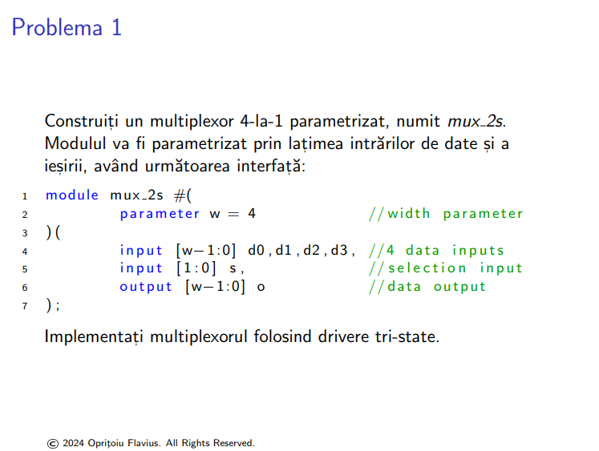
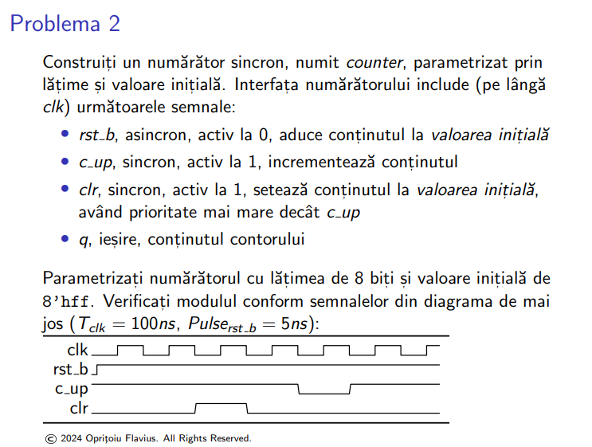
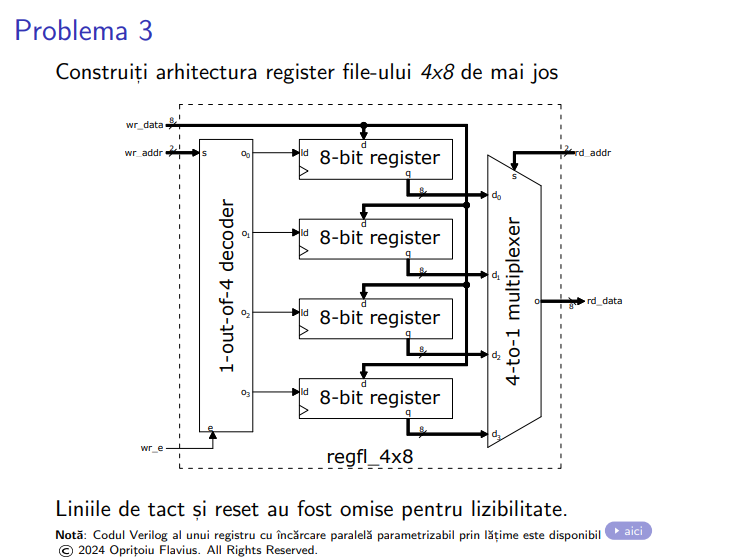

## Proiectarea modulelor parametrizate in Verilog



- ``dec_2s.v``
```verilog
// decodificator cu o intrare de selectie, s, pe 2 biti, o intrare de enable e,
// pe 1 bit si o iesire, o, pe 2^2 = 4 biti;

module dec_2s (
	input e,
	input [1:0] s,
	output reg [3:0] o
);
	always @ (*)
		case ({e,s})
			0,1,2,3: o = 4'b0000;
			4 : o = 4'b0001;
			5 : o = 4'b0010;
			6 : o = 4'b0100;
			default: o = 4'b1000; 
		endcase
endmodule
```

- ``mux_2s.v``
```verilog
module mux_2s #(
    parameter w = 4
) (
    input [w-1:0] d0, d1, d2, d3,
    input [1:0] s,
    output [w-1:0] o
);

    wire [3:0] dout; //decoder out; cei 4 biti de iesire ai decodificatorului
    dec_2s inst0(.s(s), .e(1'd1), .o(dout));
    // se construiesc caile de propagae a datelor de la fiecare intrare (d0, d1, d2, d3)
    // spre iesire; fiecare din cele 4 cai de propagare va avea un driver tri-state
    // comandat de o linie de iesire a decodificatorului
    assign o = (dout[0]) ? d0 : {w{1'bz}}; // {w{1'bz}} replica bitul 1'bz (impedanta ridicata) pe w biti
    assign o = (dout[1]) ? d1 : {w{1'bz}}; // fiecare assign verifica starea semnalului dout[k]; daca acesta
    assign o = (dout[2]) ? d2 : {w{1'bz}}; // este adevarat, assign-ul va atribui iesirii valoarea intrarii d[k]
    assign o = (dout[3]) ? d3 : {w{1'bz}};
endmodule

// desi enuntul nu solicita construirea modulului testbench, mai jos este prezentat un astfel de modul
// impreuna cu fisierul script
module mux2s_tb;
    reg [7:0] d0, d1, d2, d3;
    reg [1:0] s;
    wire [7:0] o;

    mux_2s #(.w(8)) dut(.s(s), .d0(d0), .d1(d1), .d2(d2), .d3(d3), .o(o));

    integer k;
    initial begin
        $display("d0_16\td1_16\td2_16\td3_16\ts_10\t||\to_16");
        $monitor("%h\t%h\t%h\t%h\t%d\t||\t%h", d0, d1, d2, d3, s, o);
        for (k = 0; k < 16; k = k + 1) begin
            {d3, d2, d1, d0} = $urandom();
            s = $urandom();
            #10;
        end
    end
endmodule
```

- ``run_mux2s.txt``
```tcl
# add all Verilog source files, separated by spaces
set sourcefiles {dec_2s.v mux_2s.v}

# set name of the top module
set topmodule mux2s_tb

###################################################
#####DO NOT MODIFY THE SCRIPT BELLOW THIS LINE#####
###################################################

# quit current simulation if any
quit -sim

# empty the work library if present
if [file exists "work"] {vdel -all}
#create a new work library
vlib work

# run the compiler
if [catch "eval vlog $sourcefiles"] {
    puts "correct the compilation errors"
    return
}

vsim -voptargs=+acc $topmodule

add wave *
run -all
```



- ``counter.v``
```verilog
module counter #(
    parameter w = 8,  // parametru de latime
    parameter iv = 8'hff  // parametrul de valoare initiala
) (
    input clk, rst_b, c_up, clr,
    output reg [w-1:0]q
);
    always @(posedge clk, negedge rst_b) begin //dupa posedge clk se adauga
    // toate semnalele asincrone (cum este semnalul rst_b in acest exemplu)
    // introduse prin posedge, daca sunt active la 1 sau negedge altfel; in 
    // cazul acesta, rst_b fiind activ la 0 este introdus prin negedge
        
        // in blocul always secvential, prima data sunt testate semnalele de comanda asincrone
        if (! rst_b)                q <= iv; // semnalul reset initializeaza contorul
        // dupa testarea intrarilor de comanda asincrone, sunt verificate cele sincrone
        else if (clr)               q <= iv; // semnalul clr este verificat primul pentru ca
                                             // are prioritate mai mare decat c_up
        else if (c_up)              q <= q + 1;
    end
endmodule

// in acest modul testbench, unitatea counter testata va avea parametrii:
//     w  = 8
//     iv = 8'hff
// conform cerintei problemei
module counter_tb;
    reg clk, rst_b, c_up, clr;
    wire [7:0] q; // expresia [w-1:0] din linia 6 devine in testbench [7:0] in urma inlocuirii
                  // lui w cu 8 si a calcularii expresiei w-1
    
    counter #(.w(8), .iv(8'hff)) dut(.clk(clk), .rst_b(rst_b), .c_up(c_up), .clr(clr), .q(q));
    // valorile parametrilor sunt modificate intr-un set de paranteze introduse prin simbolul #
    // intre aceste paranteze, valorile parametrilor sunt atributi ca si la conectarea porturilor:
    // folosind punctul urmat de numele parametrului iar intre paranteze de valoarea lui

    // generarea semnalului de clock se face, cvasi-intodeauna prin codul de mai jos; parametrii
    // semnalului de clock (perioada si numarul de impulsuri) sunt alese prin valorile constantelor
    // CLK_PERIOD si RUNNING_CYCLES
    localparam CLK_PERIOD=100, RUNNING_CYCLES=7;
    initial begin
        clk=0;
        repeat (2*RUNNING_CYCLES) #(CLK_PERIOD/2) clk=~clk;
    end
    // generarea semnalului de reset se face, prin codul de mai jos; durata de activare a semnalului
    // de reset este specificat prin constanta RST_DURATION
    localparam RST_DURATION=5;
    initial begin
        rst_b=0;
        #RST_DURATION rst_b=~rst_b;
    end

    // celelalte intrari (sincrone) pot fi generate in blocuri initial separate sau pot fi generate 
    // impreuna intr-un singur bloc initial ca mai jos
    initial begin
        c_up = 1; clr = 0;
        #(2*CLK_PERIOD) clr = 1;
        #(1*CLK_PERIOD) clr = 0;
        #(1*CLK_PERIOD) c_up = 0;
        #(1*CLK_PERIOD) c_up = 1;
    end
endmodule

// pentru simularea acestui testbench, se va folosi fereastra semnalelor de unda (activata 
// in Modelsim de la meniul view -> Wave)
// in sensul acesta, se vor adauga la finalul fisierului script comenzile de mai jos:
//   add wave *
//   run -all
```

- ``run_counter.txt``
```tcl
# add all Verilog source files, separated by spaces
set sourcefiles {counter.v}

# set name of the top module
set topmodule counter_tb

###################################################
#####DO NOT MODIFY THE SCRIPT BELLOW THIS LINE#####
###################################################

# quit current simulation if any
quit -sim

# empty the work library if present
if [file exists "work"] {vdel -all}
#create a new work library
vlib work

# run the compiler
if [catch "eval vlog $sourcefiles"] {
    puts "correct the compilation errors"
    return
}

vsim -voptargs=+acc $topmodule

add wave *
run -all
```



- ``rgst.v``
```verilog
module rgst #(
    parameter w=8
)(
    input clk, rst_b, ld, clr, input [w-1:0] d, output reg [w-1:0] q
);
    always @ (posedge clk, negedge rst_b)
        if (!rst_b)                 q <= 0;
        else if (clr)               q <= 0;
        else if (ld)                q <= d;
endmodule
```

- ``regfl_4x8.v``
```verilog
module regfl_4x8 (
    input clk, rst_b, wr_e,
    input [1:0] wr_addr, rd_addr,
    input [7:0] wr_data,
    output [7:0] rd_data
);
    wire [3:0] dout;
    wire [7:0] rout[0:3]; //declararea unui tablou de 4 element ([0:3]), fiecare
                          // element fiind o magistrala de 8 biti ([7:0])
    dec_2s inst0(.s(wr_addr), .e(wr_e), .o(dout));
    // se construiesc 4 instante rgst, parametrizate prin latime
    rgst #(.w(8)) inst1(.clk(clk), .rst_b(rst_b), .ld(dout[0]), .clr(1'd0), .d(wr_data), .q(rout[0]));
    rgst #(.w(8)) inst2(.clk(clk), .rst_b(rst_b), .ld(dout[1]), .clr(1'd0), .d(wr_data), .q(rout[1]));
    rgst #(.w(8)) inst3(.clk(clk), .rst_b(rst_b), .ld(dout[2]), .clr(1'd0), .d(wr_data), .q(rout[2]));
    rgst #(.w(8)) inst4(.clk(clk), .rst_b(rst_b), .ld(dout[3]), .clr(1'd0), .d(wr_data), .q(rout[3]));
    mux_2s #(.w(8)) inst5(.s(rd_addr), .d0(rout[0]), .d1(rout[1]), .d2(rout[2]), .d3(rout[3]), .o(rd_data));
endmodule

module regfl4x8_tb;
    reg clk, rst_b, wr_e;
    reg [1:0] wr_addr, rd_addr;
    reg [7:0] wr_data;
    wire [7:0] rd_data;

    regfl_4x8 dut(.clk(clk), .rst_b(rst_b), .wr_e(wr_e), .wr_addr(wr_addr), .rd_addr(rd_addr), .wr_data(wr_data), .rd_data(rd_data));

    localparam CLK_PERIOD=100, RUNNING_CYCLES=9;
    initial begin
        clk=0;
        repeat (2*RUNNING_CYCLES) #(CLK_PERIOD/2) clk=~clk;
    end
    localparam RST_DURATION=5;
    initial begin
        rst_b=0;
        #RST_DURATION rst_b=~rst_b;
    end

    initial begin
                        wr_addr = 2'h0; wr_data = 8'ha2; wr_e = 1; rd_addr = 2'h3;
        #(1*CLK_PERIOD) wr_addr = 2'h2; wr_data = 8'h2e;           rd_addr = 2'h0;
        #(1*CLK_PERIOD) wr_addr = 2'h1; wr_data = 8'h98; wr_e = 0; rd_addr = 2'h1;
        #(1*CLK_PERIOD) wr_addr = 2'h3; wr_data = 8'h55; wr_e = 1; rd_addr = 2'h2;
        #(1*CLK_PERIOD) wr_addr = 2'h0; wr_data = 8'h20;           rd_addr = 2'h0;
        #(1*CLK_PERIOD) wr_addr = 2'h1; wr_data = 8'hff;           rd_addr = 2'h3;
        #(1*CLK_PERIOD) wr_addr = 2'h3; wr_data = 8'hc7;           rd_addr = 2'h1;
        #(1*CLK_PERIOD) wr_addr = 2'h2; wr_data = 8'hb5; wr_e = 0; rd_addr = 2'h2;
        #(1*CLK_PERIOD) wr_addr = 2'h3; wr_data = 8'h91; wr_e = 1; rd_addr = 2'h3;
    end

    // in urma simularii testbench-ului se poate verifica modul de umplere al register file-ului
    // - in primul ciclu de clock se scrie la adresa 0 valoarea a2 si se citeste de la adresa 3, unde
    //   regfl-ul find gol, se va citi valoarea 0;
    // - in al doilea ciclu de tact se scrie la adresa 2 valoarea 2e, respectiv se citeste de la 
    //   adresa 0, valoarea a2, scrisa in ciclul de tact anterior
endmodule
```

- ``run_regfl4x8.txt``
```tcl
# add all Verilog source files, separated by spaces
set sourcefiles {dec_2s.v mux_2s.v rgst.v regfl_4x8.v}

# set name of the top module
set topmodule regfl4x8_tb

###################################################
#####DO NOT MODIFY THE SCRIPT BELLOW THIS LINE#####
###################################################

# quit current simulation if any
quit -sim

# empty the work library if present
if [file exists "work"] {vdel -all}
#create a new work library
vlib work

# run the compiler
if [catch "eval vlog $sourcefiles"] {
    puts "correct the compilation errors"
    return
}

vsim -voptargs=+acc $topmodule

add wave -radix hex * 
run -all
```