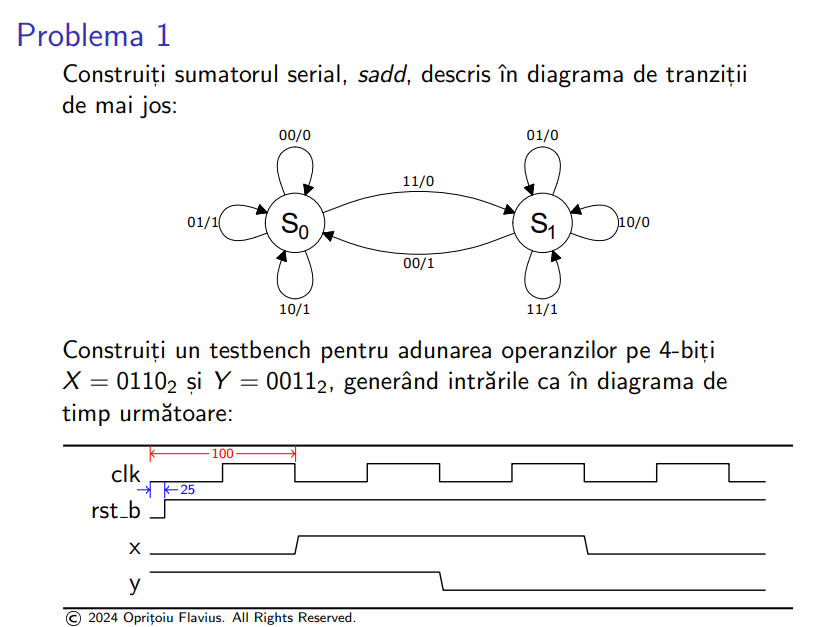
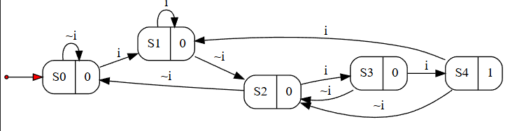
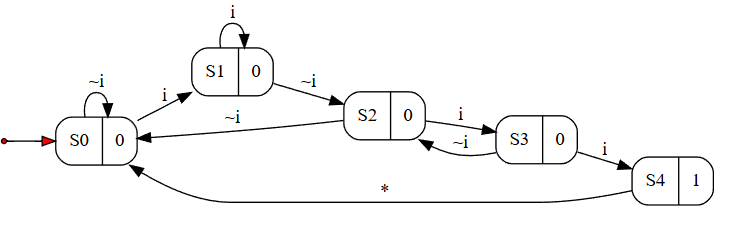
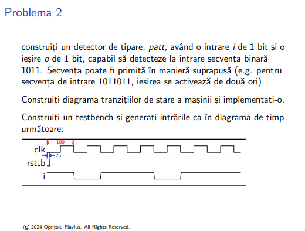

## Implementarea masinilor cu stari finite in Verilog



- Diagrama ``fsm`` cu suprapunere de stari:


- Diagrama ``fsm`` fara suprapunere de stari:


- ``sadd.v``
```verilog
module sadd(
  input clk, rst_b,
  input x, y,
  output reg out
);
  localparam S0 = 1'b0;
  localparam S1 = 1'b1;
  
  reg st, st_nxt;
  
  always @(*) begin
    case(st)
      S0: 
        if(x & y) st_nxt = S1;
        else st_nxt = S0;
      S1: 
        if((~x) & (~y)) st_nxt = S0;
        else st_nxt = S1; 
    endcase
  end
  
  always @(*) begin
    case(st)
      S0: out = 1;
      S1: out = 0;
    endcase
  end
  
  always @(posedge clk, negedge rst_b)
    if(!rst_b) st <= S0;
    else st <= st_nxt;
  
endmodule

module sadd_tb;
  reg clk, rst_b, x, y;
  wire out;
  
  sadd uut(
    .clk(clk),
    .rst_b(rst_b),
    .x(x),
    .y(y),
    .out(out)
  );
  
  always begin
    #50 clk = ~clk;
  end
  
  initial begin
    clk = 0;
    rst_b = 0;
    x = 0;
    y=1;
    
    #25 rst_b = 1;
    
    
    #100 x = 1;
    #100 y = 0;
    #100 x = 0;
    
    
  end
  
endmodule
```

- ``run_sadd.txt``
```tcl
# add all Verilog source files, separated by spaces
set sourcefiles {sadd.v}

# set name of the top module
set topmodule sadd_tb

###################################################
#####DO NOT MODIFY THE SCRIPT BELLOW THIS LINE#####
###################################################

# quit current simulation if any
quit -sim

# empty the work library if present
if [file exists "work"] {vdel -all}
#create a new work library
vlib work

# run the compiler
if [catch "eval vlog $sourcefiles"] {
    puts "correct the compilation errors"
    return
}

vsim -voptargs=+acc $topmodule

add wave *
run -all
```



- ``patt.v``
```verilog
// Se va construi mai intai diagrama tranzitiilor de stare
// Sunt furnizate 2 diagrame: pentru cazul in care tiparele 
//   sunt suprapuse si, respectiv cand nu sunt suprapuse
// Implementarea de mai jos considera tipare suprapuse

// Pentru a creste gradul de dificultate al exercitiului, se pot
// considera tipare mai complexe (pe 5/6 biti)
module patt(
  input clk, rst_b, i,
  output o
);
  localparam S0=0, S1=1, S2=2, S3=3, S4=4;
  reg [2:0] st, st_nxt;
  always @ (*)
    case (st)
      S0:       st_nxt = i ? S1 : S0;
      S1:       st_nxt = i ? S1 : S2;
      S2:       st_nxt = i ? S3 : S0;
      S3:       st_nxt = i ? S4 : S2;
      S4:       st_nxt = i ? S1 : S2;
      default:  st_nxt = S0;
    endcase
  assign o = (st == S4);
  always @ (posedge clk, negedge rst_b)
    if (! rst_b)          st <= S0;
    else                  st <= st_nxt;
endmodule

module patt_tb;
  reg clk, rst_b, i;
  wire o;
  patt inst0(.clk(clk), .rst_b(rst_b), .i(i), .o(o));
  localparam CLK_PERIOD=100, CLK_CYCLES=8, RST_PULSE=10;
  initial begin
    clk = 0;
    repeat (2*CLK_CYCLES) #(CLK_PERIOD/2) clk = 1 - clk;
  end
  initial begin
    rst_b = 0;
    #(RST_PULSE) rst_b = 1;
  end
  initial begin
                    i = 1;
    #(1*CLK_PERIOD) i = 0; 
    #(1*CLK_PERIOD) i = 1;
    #(2*CLK_PERIOD) i = 0;
    #(1*CLK_PERIOD) i = 1;
  end
endmodule
```

- ``run_patt.txt``
```tcl
# add all Verilog source files, separated by spaces
set sourcefiles {patt.v}

# set name of the top module
set topmodule patt_tb

###################################################
#####DO NOT MODIFY THE SCRIPT BELLOW THIS LINE#####
###################################################

# quit current simulation if any
quit -sim

# empty the work library if present
if [file exists "work"] {vdel -all}
#create a new work library
vlib work

# run the compiler
if [catch "eval vlog $sourcefiles"] {
    puts "correct the compilation errors"
    return
}

vsim -voptargs=+acc $topmodule

add wave *
run -all
```