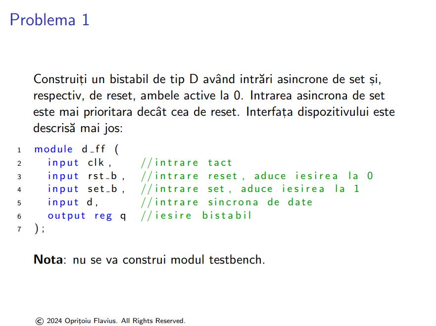
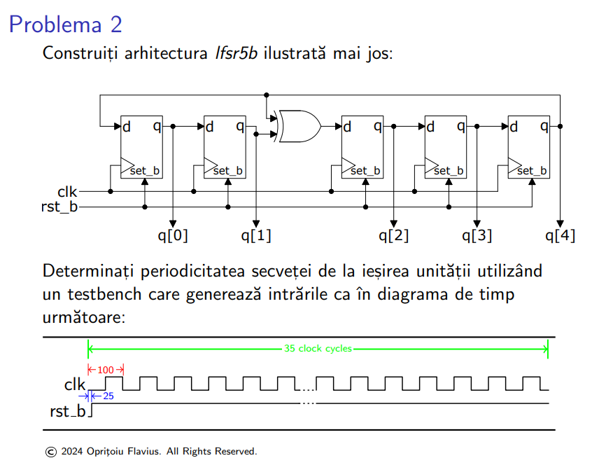
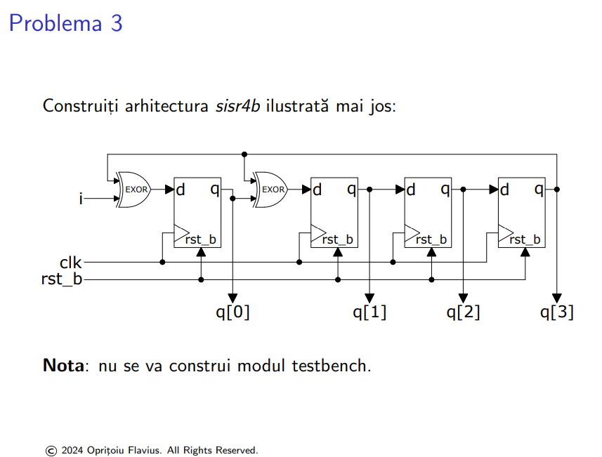

- ``d_ff.v``
```verilog
// ex1
module d_ff (
    input clk,       // intrare tact
    input rst_b,     // intrare reset, activeaza iesirea la 0
    input set_b,     // intrare set, activeaza iesirea la 1
    input d,         // intrare sincrona de date
    output reg q     // iesire bistabil
);

always @ (posedge clk or negedge rst_b or negedge set_b) begin
    if (!set_b) 
        q <= 1; 
    else if (!rst_b) 
        q <= 0;  
    else 
        q <= d; 
end

endmodule

```




- ``lfsr5b.v``
```verilog
// poate intra la test, merge si asa si cu generate (vector de instante)
module lfsr5b (
    input clk,          // intrare ceas
    input rst_b,        // reset asincron activ pe 0
    output [4:0] q      // iesire pe 5 biti
);

    wire feedback;      
    assign feedback = q[4] ^ q[1]; // facem xor intre iesirea 1 si 4 a flipflop-urilor

    d_ff dff0 (.clk(clk), .rst_b(1'b1), .set_b(rst_b), .d(feedback), .q(q[0]));
    d_ff dff1 (.clk(clk), .rst_b(1'b1), .set_b(rst_b), .d(q[0]), .q(q[1]));
    d_ff dff2 (.clk(clk), .rst_b(1'b1), .set_b(rst_b), .d(q[1]), .q(q[2]));
    d_ff dff3 (.clk(clk), .rst_b(1'b1), .set_b(rst_b), .d(q[2]), .q(q[3]));
    d_ff dff4 (.clk(clk), .rst_b(1'b1), .set_b(rst_b), .d(q[3]), .q(q[4]));

endmodule

module lfsr5b_tb;

    reg clk;
    reg rst_b;
    wire [4:0] q;

    lfsr5b uut (
        .clk(clk),
        .rst_b(rst_b),
        .q(q)
    );

    always begin
        #50 clk = ~clk;
    end

    initial begin
        clk = 0;
        rst_b = 0;
        #25 rst_b = 1; 
    end


endmodule
```



- ``sisr4b.v``
```verilog
module sisr4b(
  input i,
  input clk,
  input rst_b,
  output [3:0] q
);

    wire feedback1, feedback2;      
    assign feedback1 = i ^ q[3];
    assign feedback2 = q[0] ^ q[3];

    d_ff dff0 (.clk(clk), .rst_b(rst_b), .set_b(1'b1), .d(feedback1), .q(q[0]));
    d_ff dff1 (.clk(clk), .rst_b(rst_b), .set_b(1'b1), .d(feedback2), .q(q[1]));
    d_ff dff2 (.clk(clk), .rst_b(rst_b), .set_b(1'b1), .d(q[1]), .q(q[2]));
    d_ff dff3 (.clk(clk), .rst_b(rst_b), .set_b(1'b1), .d(q[2]), .q(q[3]));

endmodule;
```