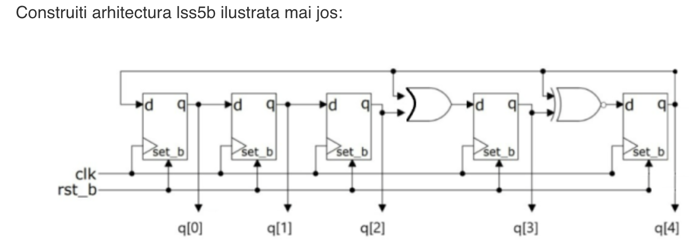
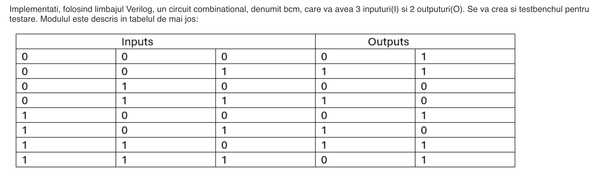
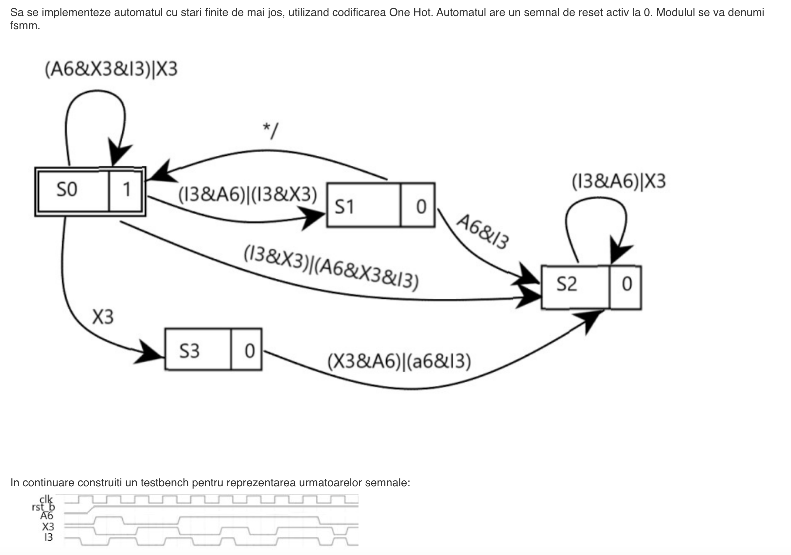
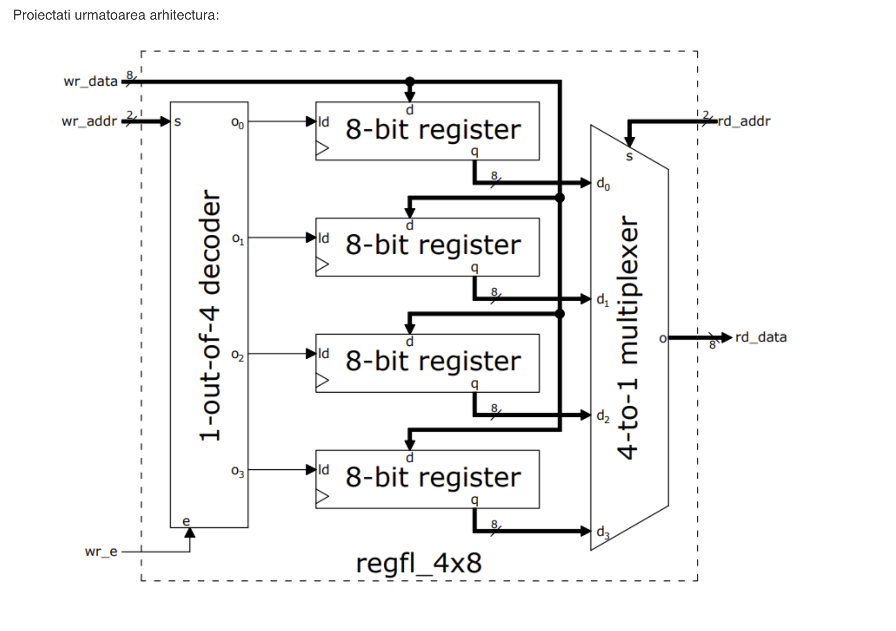

- ``lss5b.v``
```verilog
module d_ff (
    input clk,       
    input rst_b,    
    input set_b,     
    input d,       
    output reg q
);

always @ (posedge clk or negedge rst_b or negedge set_b) begin
    if (!set_b) 
        q <= 1; 
    else if (!rst_b) 
        q <= 0;  
    else 
        q <= d; 
end

endmodule


module lss5b(
    input clk,          
    input rst_b,   
    output [4:0] q 
);

    d_ff dff0 (.clk(clk), .rst_b(1'b1), .set_b(rst_b), .d(q[4]), .q(q[0]));
    d_ff dff1 (.clk(clk), .rst_b(1'b1), .set_b(rst_b), .d(q[0]), .q(q[1]));
    d_ff dff2 (.clk(clk), .rst_b(1'b1), .set_b(rst_b), .d(q[1]), .q(q[2]));
    d_ff dff3 (.clk(clk), .rst_b(1'b1), .set_b(rst_b), .d(q[2] | q[4]), .q(q[3]));
    d_ff dff4 (.clk(clk), .rst_b(1'b1), .set_b(rst_b), .d(q[3] ^ q[4]), .q(q[4]));
  

endmodule
```



- ``bcm.v``
```verilog
module bcm(
  input i1,
  input i2,
  input i3,
  output reg o1,
  output reg o2
);

  always @(*) begin
    case({i1,i2,i3}) 
      3'b000: begin o1 = 0; o2 = 1; end
      3'b001: begin o1 = 1; o2 = 1; end
      3'b010: begin o1 = 0; o2 = 0; end
      3'b011: begin o1 = 1; o2 = 0; end
      3'b100: begin o1 = 0; o2 = 1; end
      3'b101: begin o1 = 1; o2 = 0; end
      3'b110: begin o1 = 1; o2 = 1; end
      3'b111: begin o1 = 0; o2 = 1; end
    endcase
  end

endmodule

module bcm_tb;
  reg [2:0]i;
  wire o1,o2;
  
  bcm bcm_i (.i1(i[0]), .i2(i[1]), .i3(i[2]), .o1(o1), .o2(o2));
  
  integer k;
  initial begin
    i = 0;
    for (k=1; k<8; k=k+1)
      #10 i=k;
  end
  
  
endmodule
```


- ``fsmm.v``
```verilog
module fsmm (
    input clk,
    input rst_b,
    input A6,
    input X3,
    input I3,
    output reg [3:0] state
);
    localparam S0 = 4'b1000;
    localparam S1 = 4'b0100;
    localparam S2 = 4'b0010;
    localparam S3 = 4'b0001;

    reg [3:0] next_state;

    always @(*) begin
        case (state)
            S0: begin
                if ((A6 & X3 & I3) | X3)
                    next_state = S1;
                else
                    next_state = S0;
            end
            S1: begin
                if ((I3 & A6) | (I3 & X3))
                    next_state = S2;
                else
                    next_state = S1;
            end
            S2: begin
                if ((X3 & A6) | (A6 & I3))
                    next_state = S3;
                else
                    next_state = S2;
            end
            S3: begin
                if ((X3 & A6) | (A6 & I3))
                    next_state = S0;
                else
                    next_state = S3;
            end
            default: next_state = S0;
        endcase
    end

    always @(posedge clk or negedge rst_b) begin
        if (!rst_b)
            state <= S0;
        else
            state <= next_state;
    end
endmodule


module fsmm_tb;
    reg clk;
    reg rst_b;
    reg A6, X3, I3;
    wire [3:0] state;

    fsmm uut (
        .clk(clk),
        .rst_b(rst_b),
        .A6(A6),
        .X3(X3),
        .I3(I3),
        .state(state)
    );

    always #5 clk = ~clk;

    initial begin
        clk = 0;
        rst_b = 0;
        A6 = 0; X3 = 0; I3 = 0;

        #10 rst_b = 1;

        #10 A6 = 1; X3 = 0; I3 = 0;
        #10 X3 = 1; A6 = 0;
        #10 I3 = 1; A6 = 1; X3 = 1;
        #10 A6 = 0; X3 = 1; I3 = 0;
        #10 A6 = 1; X3 = 0; I3 = 1;
        #10 X3 = 1;

        #50 $finish;
    end

    initial begin
        $monitor("Time=%0d, clk=%b, rst_b=%b, A6=%b, X3=%b, I3=%b, state=%b", $time, clk, rst_b, A6, X3, I3, state);
    end
endmodule
```


- ``regfl_4x8.v``
```verilog
module regfl_4x8 (
    input [7:0] wr_data,
    input [1:0] wr_addr,
    input [1:0] rd_addr,
    input wr_e,
    input clk,                 
    output [7:0] rd_data      
);

    wire [3:0] decode_out;      
    wire [7:0] q0, q1, q2, q3;

    assign decode_out = (wr_e) ? (1 << wr_addr) : 4'b0000;

    reg [7:0] reg0, reg1, reg2, reg3;

    always @(posedge clk) begin
        if (decode_out[0]) reg0 <= wr_data;
        if (decode_out[1]) reg1 <= wr_data;
        if (decode_out[2]) reg2 <= wr_data;
        if (decode_out[3]) reg3 <= wr_data;
    end

    assign rd_data = (rd_addr == 2'b00) ? reg0 :
                     (rd_addr == 2'b01) ? reg1 :
                     (rd_addr == 2'b10) ? reg2 :
                     (rd_addr == 2'b11) ? reg3 : 8'b00000000;

endmodule
```
