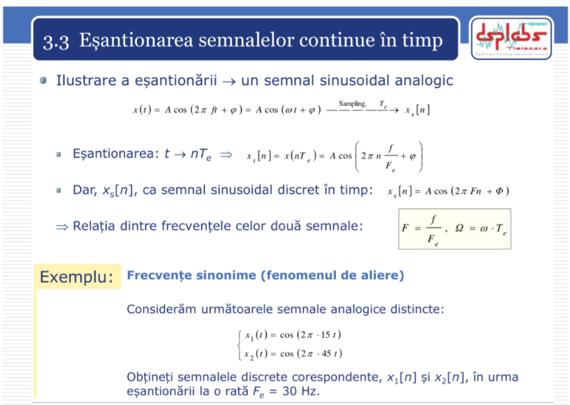
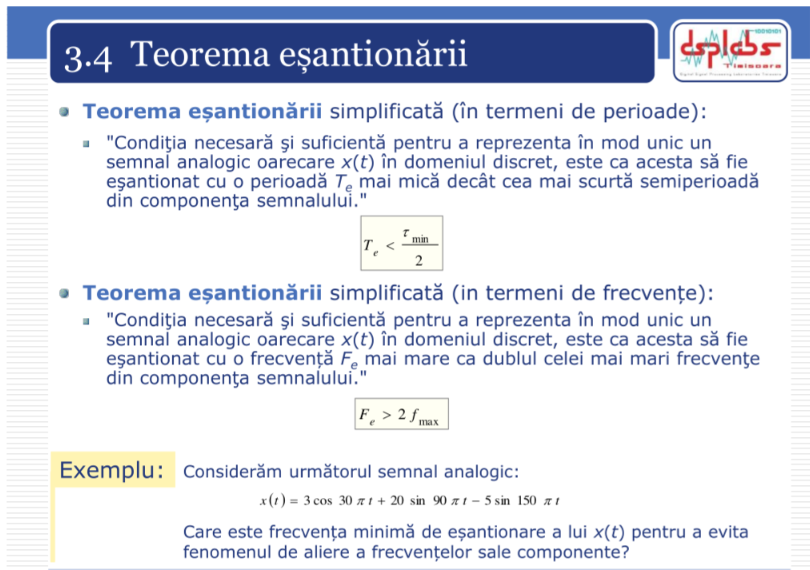

1. 

- The problem provided involves finding the discrete signals corresponding to the analog signals after sampling at a rate . 
- The analog signals are: 
	- $x_1(t) = \cos(2 \pi \cdot 15 \cdot t)$
	- $x_2(t) = \cos(2 \pi \cdot 45 \cdot t)$ 
- Given the sampling rate , $F_e = 30 \, \text{Hz}$, the discrete signals and can be found using the following relationship between continuous time and discrete time: $x[n] = x(nT_s) = x\left(\frac{n}{F_e}\right)$ where $T_s = \frac{1}{F_e}$ is the sampling period. Let's now proceed with finding the discrete versions of the signals. 
- Signal $x_1[n]$: 
	- For $x_1(t) = \cos(2 \pi \cdot 15 \cdot t)$, after sampling at $F_e = 30 \, \text{Hz}$, we have: $x_1[n] = \cos\left(2 \pi \cdot 15 \cdot \frac{n}{30}\right) = \cos\left(\pi n\right)$. This simplifies to: $x_1[n] = (-1)^n$ 
- Signal $x_2[n]$: 
	- For $x_2(t) = \cos(2 \pi \cdot 45 \cdot t)$, after sampling at $F_e = 30 \, \text{Hz}$, we have: $x_2[n] = \cos\left(2 \pi \cdot 45 \cdot \frac{n}{30}\right) = \cos\left(3 \pi n\right)$ Using the fact that $\cos(3 \pi n) = \cos(\pi n)$, we get: $x_2[n] = (-1)^n$ 
- Conclusion: The two signals are both equal to $(-1)^n$. This phenomenon, where distinct analog frequencies result in identical discrete signals after sampling, is known as aliasing.

2. 

- The given problem is asking to determine the minimum sampling frequency for the signal $x(t)$ in order to avoid aliasing.
- The signal is $x(t) = 3 \cos(30 \pi t) + 20 \sin(90 \pi t) - 5 \sin(150 \pi t)$
- Step 1: Identify the frequencies of the components (to find the frequency of each component, we need to extract the coefficients of $pi t$ from each term)
	- $3 \cos(30 \pi t)$: The angular frequency $\omega_1 = 30 \pi$, so the frequency is $f_1 = \frac{30 \pi}{2 \pi} = 15 \, \text{Hz}$
	- $20 \sin(90 \pi t)$: The angular frequency $\omega_2 = 90 \pi$, so the frequency is $f_2 = \frac{90 \pi}{2 \pi} = 45 \, \text{Hz}$
	- $-5 \sin(150 \pi t)$: The angular frequency $\omega_3 = 150 \pi$, so the frequency is $f_3 = \frac{150 \pi}{2 \pi} = 75 \, \text{Hz}$
- Step 2: Determine the maximum frequency: $f_3 = 75 \, \text{Hz}$
- Step 3: Apply the Nyquist theorem
	- According to the Nyquist sampling theorem, the sampling frequency must be at least twice the highest frequency present in the signal to avoid aliasing. Thus, the minimum sampling frequency $F_s$ should be: $F_s = 2 \times f_{\text{max}} = 2 \times 75 = 150 \, \text{Hz}$