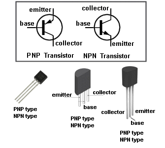
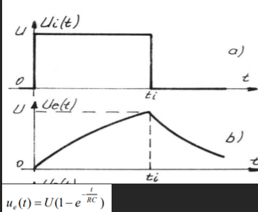
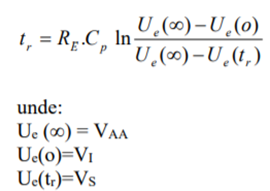
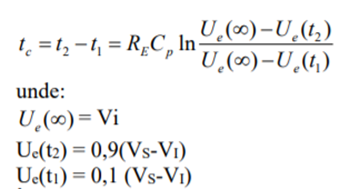
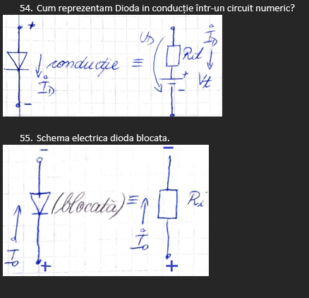

## Tranzistor
1. Cum trebuie, din punct de vedere teoretic, polarizate cele două joncțiuni ca un tranzistor bipolar să fie considerat în regim activ?

 - Joncțiunea BE polarizată direct (permite trecerea curentului)
 - Joncțiunea BC polarizată invers (previne trecerea curentului)

2. Cum trebuie d. p. d. v. teoretic polarizate cele două joncțiuni pentru ca un tranzistor să fie considerat blocat?
- Joncțiunea BE polarizată invers
- Joncțiunea BC polarizată invers

3. Care dintre mărimile unui tranzistor bipolar rămân, practic, nemodificare atunci când se află în regim saturat?
- **Curentul de colector ($I_C$)**: Odată ce tranzistorul ajunge în regimul de saturare, curentul de colector nu mai depinde semnificativ de tensiunea de intrare (tensiunea bază-colector) și ajunge la o valoare constantă, determinată de rezistența colectorului și de sursa de alimentare.
- **Tensiunea colector-emitor ($V_{CE}$)**: În regimul saturat, această tensiune devine foarte mică, iar valoarea sa nu mai variază semnificativ cu schimbarea curentului de bază.

4. Ce caracterizează tranzistorul bipolar saturat? 
- În acest caz, curentul prin tranzistor este cel mai mare, deoarece tranzistorul bipolar saturat se comportă ca un întrerupător închis, curentul emitor-colector fiind independent de curentul bazei. Acest fapt se datorează polarizării directe bază-colector și bază-emitor.

5. De ce în circuitele numerice se preferă, cu prioritate, regimurile blocat și saturat ale unui tranzistor bipolar?
- Deoarece în aceste cazuri valorile tensiunilor din circuit au valori bine cunoscute

6. Cine influențează asupra timpului de saturare a unui tranzistor bipolar?
- Timpul de saturare este influențat de curentul de bază
- $t_s$ = timpul de saturație 
- $I_{bi}$ = curentul de bază invers 
- $I_{bd}$ = curentul de bază direct $$ t_s \approx \frac{1}{I_{bi}} $$ $$ t_s \approx I_{bd} $$

7.  Cine influențează asupra timpului de ridicare a unui tranzistor bipolar?
- $I_{BD}$, deoarece $tr = \frac{1}{I_{BD}}$

8. Cum se numește modul de funcționare al celor două tranzistoare de la ieșirea circuitelor integrate TTL?
- Modul de funcționare al celor două tranzistoare de la ieșirea circuitelor integrate TTL este în contratimp. Acest mod de funcționare implică faptul că tranzistoarele de la ieșire lucrează în regim complementar, adică atunci când unul dintre tranzistoare este în conducție, celălalt este blocat.

9. Pentru a se evita intrarea unui tranzistor într-un regim saturat puternic, se utilizează în practică un tranzistor compus. Cum este folosit?
- Tranzistorul compus este folosit în practică pentru construirea circuitelor TTL.

10. Ce avantaje decurg din faptul că circuitul de ieșire aferent circuitelor integrate TTL (cele două tranzistoare de la ieșire) lucrează în contra-timp?
- impedanțe de ieșire mici pentru cele două stări logice
- generarea unor curenți de ieșire relativ mari față de regimul static de funcționare
- asigurarea unui curent de încărcare și descărcare mare
- scăderea timpului de propagare mediu
- reducerea substanțială a puterii disipate de circuit

11. De ce două porți TTL nu pot avea ieșirea comună? Ce împiedică acest lucru?
- Parametrii porții se pot modifica, (dacă tranzistoarele nu se distrug prin ambalare termică) pierzându-se imunitatea la zgomot. Pentru a cupla, totuși, în paralel mai multe porți se utilizează circuite cu colector în gol.

12. Ce regimuri de funcționare a unui tranzistor bipolar asigură diferența maximă a nivelelor de tensiune?
- Între regimurile de funcționare BLOCAT și SATURAT există cea mai mare diferență de tensiune. Cu cât diferența dintre nivelele corespondente celor două stări este mai mare, cu atât funcționarea tranzistorului este mai bună.

13. De ce tranzistorul bipolar este numit producător de curent de colector?
- Deoarece curentul de colector $I_c$ este generat și amplificat prin controlul unui curent mult mai mic de bază $I_b$. Prin amplificarea curentului de bază, tranzistorul generează un curent de colector mai mare, ceea ce îl face un element cheie în procesele de amplificare și comutare în circuitele electronice.

14. Care este ecuația de bază a unui tranzistor bipolar?
- $I_c = \alpha * I_E + I_{C0}$
- $\alpha$ = factor de amplificare 
- $I_{C0}$ = curent rezidual

15. Care sunt timpii de comutare ai unui tranzistor bipolar?
- Timpii de comutare sunt timpul de ridicare si cel de cădere.
- Timpul de ridicare reprezintă timpul necesar pentru a permite curentului de colector să crească de la valoarea sa inițială la valoarea sa maximă când tranzistorul trece din starea de blocare în starea activă.
- Timpul de cădere reprezintă timpul necesar pentru a permite curentului de colector să cadă de la valoarea sa maximă la valoarea aproape zero, când tranzistorul trece din starea activă sau saturată în starea de blocaj.

16. Care sunt valorile tipice pentru nivelul de tensiune superior, pentru nivelul de tensiune inferior și pentru tensiunea de prag, la familia de circuite integrate TTL?
- $V_{L} = 0.2V$ (nivel tensiune inferior)
- $V_H = 3.5V$ (nivel tensiune superior)
- $V_T = 1.5V$ (tensiune de prag)

17. Cum se numește tranzistorul de la intrarea TTL? 
- Tranzistor multiemitor
## RC, diode
1. De ce se numește RC-trece-sus?
- Circuitul RC-trece-sus își primește numele datorită comportamentului său de a permite trecerea frecventelor înalte și de a atenua frecvențele joase. Astfel, circuitul blochează frecvențele joase, „lăsând să treacă” frecvențele înalte.

2. De ce circuitul RC-trece-jos poate simula un circuit numeric? Explicați pe scurt.
- Deoarece circuitul RC-trece-jos este un filtru care permite trecerea semnalelor de frecvență joasă cu distorsiuni minime și atenuarea puternică a semnalelor de frecvență înaltă. Acest comportament este similar cu modul în care un sistem numeric tratează semnalele.

3. Definește timpul de ridicare și timpul de coborâre.
$$ \text{tr} = R \cdot C \cdot \ln\left(\frac{V_H - V_L}{V_H - V_T}\right) $$
$$ \text{tc} = R \cdot C \cdot \ln\left(\frac{V_L - V_H}{V_L - V_T}\right) $$

4. Care este răspunsul unui circuit RC-trece jos la un semnal treaptă?
- 

5. De ce circuitele realizate numai cu diode nu sunt adecvate pentru realizarea unor circuite logice?
- Deoarece timpii sunt mari și depind de valorile rezistențelor din circuit.

6. Ce funcții logice se pot genera cu dioda semiconductoare? 
- ȘI, SAU

7.  Cum explicați că timpul de ridicare la un circuit ȘI cu diode este mai mare decât timpul de coborâre?

- 
- 
- Timpul de ridicare este mai mare decât timpul de coborâre, fapt care poate fi dedus din cele două formule, care arată că raportul funcției logaritmice este mai mare în cazul timpului de ridicare, decât în cazul timpului de coborâre.

8. Poarta ȘI din cadrul familiei de circuite TTL are performanțe superioare față de poarta ȘI-NU?
- Nu, acestea au performanțe similare
## Capacitatea de accelerare

1.  Ce rol are capacitatea de accelerare?
- Micșorează timpii de comutare ai tranzistorului bipolar. Totuși costurile sunt mari și pot apărea întârzieri și consum crescut de energie, deci se evită integrarea unor astfel de capacități într-un circuit numeric.

2. De ce nu se poate utiliza la circuitele integrate numerice o capacitate de accelerare?
- În circuitele integrate numeric nu se utilizează capacități de accelerare pentru a proteja performanța, eficiența și viteza de operare a acestora. Capacitățile mari de încărcare pot duce la întârzieri și consum crescut de energie, ceea ce poate duce la compromiterea unui sistem.
## Familii, nivel de integrare
1.  De ce sunt circuitele grupate pe familii de circuite? (+ cele mai importante caracteristici)
- Încercarea de a obține un circuit cu toți parametrii cu valori cât mai performante este imposibil, deoarece de multe ori performanțele pot fi contradictorii. Din această cauză, s-a ajuns la o soluție de compromis, unde un circuit este performant din punct de vedere al unui anumit parametru.
	- Cele mai importante caracteristici:
		- factorul de încărcare mare la ieșire
		- imunitate la zgomot mare
		- timpi de propagare mici
		- putere consumată mică

2. De ce pentru o familie de circuite integrate numerice se utilizează caracteristici limită de transfer pentru a defini nivele de tensiune?
- Parametrii interni ai dispozitivelor electronice pot influența nivelele de tensiune. Din această cauză, dispozitivele electronice grupate pe familii de circuite integrate au nevoie de caracteristici limită de transfer. Caracteristicile limită de transfer sunt reprezentate prin valori specificate în catalog, pentru nivelele de tensiune determinate în cazul cel mai defavorabil. Funcționarea sigură a dispozitivelor este garantată de utilizarea anumitor nivele de tensiune specificate în catalog. Dacă nu se respectă plajele admise la intrare, circuitul logic poate să nu mai funcționeze corect.

3. Enumerați tipurile de circuite integrate numerice, după gradul de integrare.
- circuite integrate pe scară mică (SSI – small scale integration)
- circuite integrate pe scară medie (MSI – medium scale integration)
- circuite integrate pe scară mare (LSI – large scale integration)
- circuite integrate pe scară foarte mare (VLSI – very large scale integration)

4. Cum se modifică capacitatea parazită odată cu nivelul de integrare?
- Aceasta crește

5. De ce este recomandat la realizarea unui sistem numeric, utilizarea circuitelor din aceeași serie?
- Pentru a nu interveni cerințe contradictorii referitoare la performanța parametrilor circuitului.

## Factori de încărcare

1. Ce mărime electrica definește factorii de încărcare la intrare?
- Capacitatea

2. La intrare, câți factori de încărcare cunoașteți? Vă rog să-i definiți!
- Există doi factori de încărcare la intrare, și anume:
	-  $FI_{L}$ – factorul de încărcare la intrare pentru „0 logic”
	- $FI_{H}$ - factorul de încărcare la intrare pentru „1 logic”

3. Factorul de încărcare de la ieșirea circuitelor integrate numerice se exprimă printr-un număr întreg și pozitiv. Această afirmație este validă și dacă se folosesc circuite din serii diferite?
- Afirmația este corectă și se aplică indiferent dacă se folosesc circuite din serii diferite. Factorul de încărcare este un număr întreg și pozitiv, dar totuși trebuie să se țină cont de caracteristicile electrice ale fiecărui tip de circuit integrat și de condițiile de încărcare ale ieșirii.

4. Care ar fi valoarea ideală a factorului de încărcare la intrare/ieșire?
- Factorul de încărcare reprezintă raportul dintre capacitatea de intrare a porților conectate și capacitatea de ieșire a porții conducătoare. Pentru TTL, factorul de încărcare ideal este 1, ceea ce înseamnă că o poartă logică poate conduce exact o altă poartă logică fără să degradeze performanțele.

## Diverse
1.  Care sunt cele două metode de bază în analiza circuitelor?
- metoda clasică a rezolvării ecuațiilor integro-diferențiale asociate circuitului
- metode care se bazează pe principiul suprapunerii efectelor
- Explicatie: 
	- Metoda clasică a rezolvării ecuațiilor integro-diferențiale asociate circuitului se bazează pe formularea ecuațiilor care descriu comportamentul circuitului electric folosind legile fundamentale ale circuitelor, cum sunt **Legea lui Ohm**, **Legea lui Kirchhoff pentru curente (KCL)** și **Legea lui Kirchhoff pentru tensiuni (KVL)**.
	- Principiul suprapunerii efectelor este un principiu fundamental în analiza liniară a circuitelor electrice, care afirmă că, pentru un circuit liniar, răspunsul total la un set de surse poate fi obținut prin adunarea răspunsurilor individuale cauzate de fiecare sursă în parte, presupunând că sursele sunt independente.

2. Care sunt mărimile subunitare ale unui curent? Notați primele patru mărimi subunitare și puneți valoarea.
- **Miliamperul (mA)**: 1 mA = $10^{-3} A$
- **Microamperul (µA)**: 1 µA = $10^{-6} A$
- **Nanoamperul (nA)**: 1 nA = $10^{-9} A$
- **Picoamperul (pA)**: 1 pA = $10^{-12} A$

3. 

4. De ce timpii de propagare se definesc în funcție de tensiunea de prag?
- Tensiunea de prag are scopul de a delimita valorile semnalului în două situații, corespunzătoare nivelului „0 logic” (valorile sunt mai mici decât $V_{t}$, tensiunea de prag) și „1 logic” (valorile semnalului sunt mai mari decât $V_{t}$, tensiunea de prag). Acest fapt favorizează utilizarea circuitelor pe post de funcții logice și ajută la o interpretare mai facilă a semnalelor.

5.  Puterea dinamică consumată de circuitele integrate numerice se poate lua din catalogul circuitului sau trebuie calculată în funcție de particularitățile de funcționare și de proiectare ale sistemului numeric?
- Trebuie calculata: $P_D = C_p * F * {V_{CC}}^2$
	- $P_D$ = puterea dinamică consumată
	- $C_p$ = capacitatea parazită
	- F = frecvența
	- $V_{CC}$ = tensiunea de alimentare
- Parametrii enumerați se iau din catalogul circuitului.

6. Care sunt componentele capacității parazite?
 - Ea este suma următoarelor capacități:
	 - capacitatea de fir (proporțională cu lungimea firului, invers proporțională cu distanța fir-masă)
	 - capacitatea de intrare
	 - capacitatea de ieșire