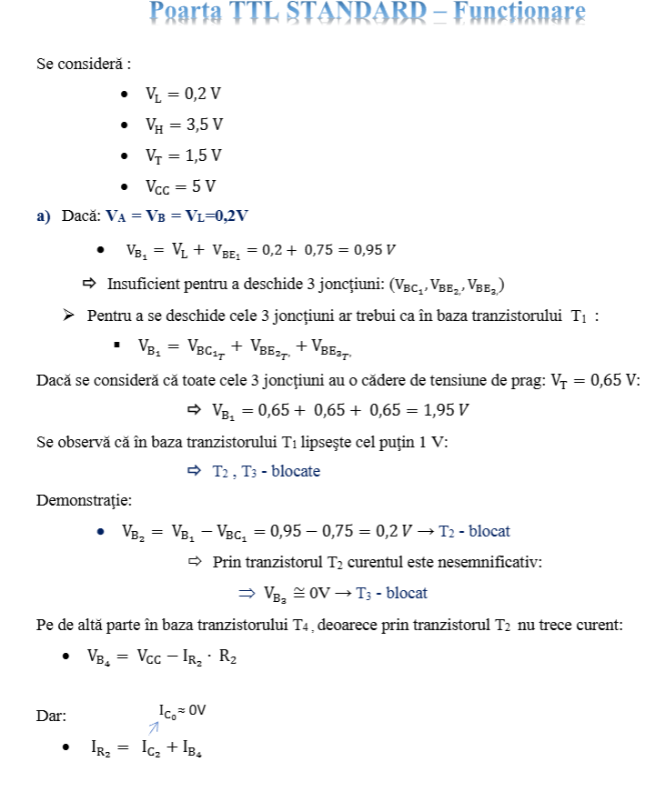

- Factorii de încărcare pot fi numere negative?
	- Nu, doar numere naturale pozitive, deoarece înseamnă câte porți sunt comandate.

---

- Care sunt parametrii semnalului real?

---

- Care sunt cele trei semnale de bază? Desenați.

---

- Reprezentați grafic dioda în conducție și dioda blocată într-un circuit numeric.
- ``Ud`` = tensiunea de la intrarea diodei, ``Vt`` = tensiunea de prag

---
## Poarta ȘI cu diode semiconductoare
 - Desenați circuitul pentru poarta ȘI cu diode semiconductoare, realizați tabelul de adevăr si explicați comportamentul

- Concluzie: Dacă la oricare intrare din circuitul ȘI se aplică ``VL => Vo = VL``

---

## Poarta SAU cu diode semiconductoare

---

- De ce timpul de coborâre este mai mare pentru poarta ȘI este mai mare decât cel pentru poarta SAU? 
	- Pentru poarta ȘI, conform desenelor de mai sus, curentul trebuie să treacă printr-o rezistență pentru a se descărca în ground, pe când la poarta SAU se poate descărca direct.

---
- Care este cel mai mare timp al unui tranzistor?
	- Cel din regim blocat în regim de saturare.

---

- Care este cea mai folosită poartă logică în circuitele TTL?
	- Poarta ȘI-NU.

---

- Care sunt modurile de funcționare ale unui tranzistor bipolar?

1. Regim blocat:
	- joncțiunea $j_{BE}$ este polarizată în sens invers
	- joncțiunea $j_{BC}$ este polarizată în sens invers
 - =>Prin cele două joncțiuni trece cel mai mic curent posibil ce poate trece printr-un tranzistor conectat.
 
2. Regim activ:
	- joncțiunea $j_{BE}$ este polarizată în sens direct
	- joncțiunea $j_{BC}$ este polarizată în sens invers
- => Tranzistorul este în regim normal de funcționare și se comportă fie ca repetor (pentru curentul din emitor, configurație common-collector) sau ca amplificator (pentru curentul din bază, configurație common-emitter).

3. Regim saturat:
	- joncțiunea $j_{BE}$ este polarizată în sens direct
	- joncțiunea $j_{BC}$ este polarizată în sens direct
- => Tranzistorul se comportă ca un întrerupător închis datorită acumulărilor de sarcini în bază.

4. Regim invers:
	- joncțiunea $j_{BE}$ este polarizată în sens invers
	- joncțiunea $j_{BC}$ este polarizată în sens direct
- => Tranzistorul se comportă ca un atenuator.

--- 
## Invertor cu tranzistoare bipolare

---

## Poarta TTL STANDARD

---

## Poarta ȘI-NU TTL

