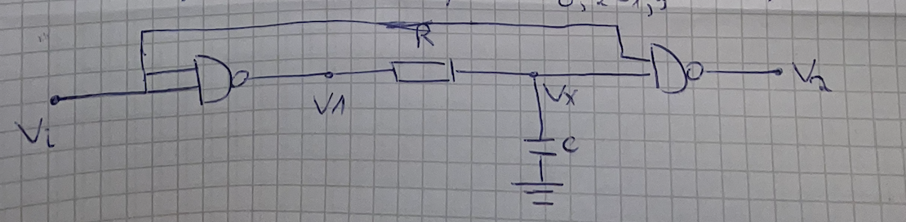
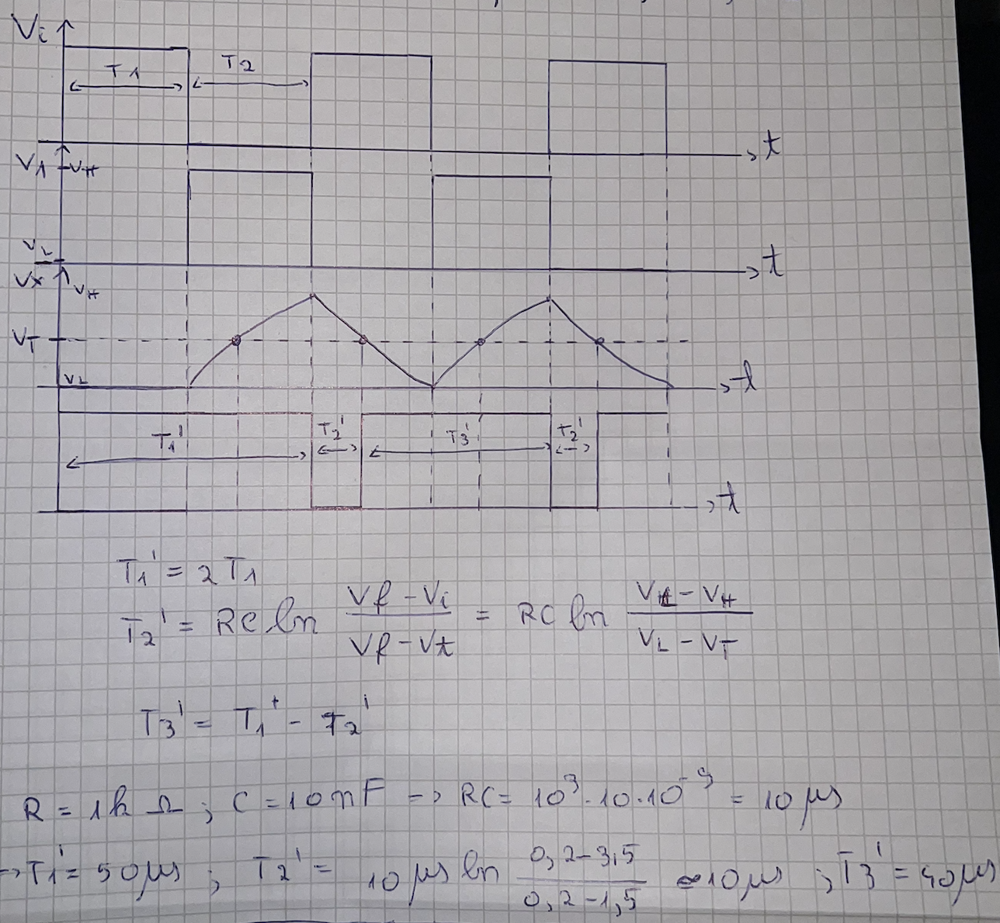
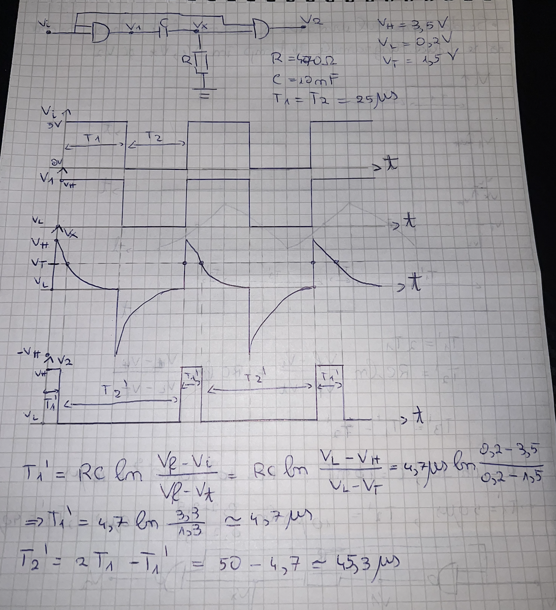
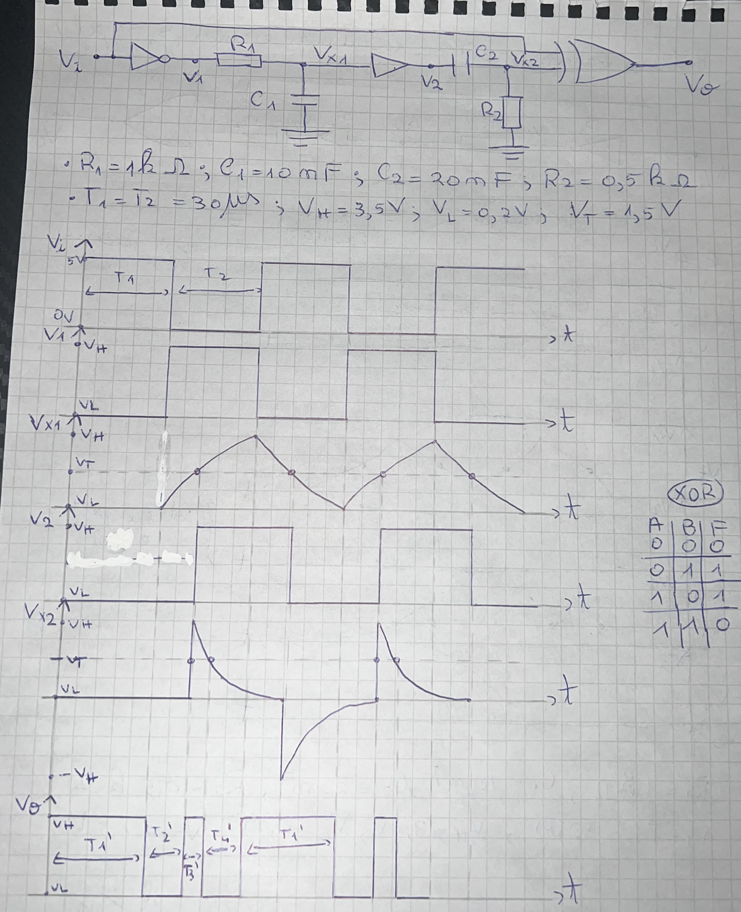
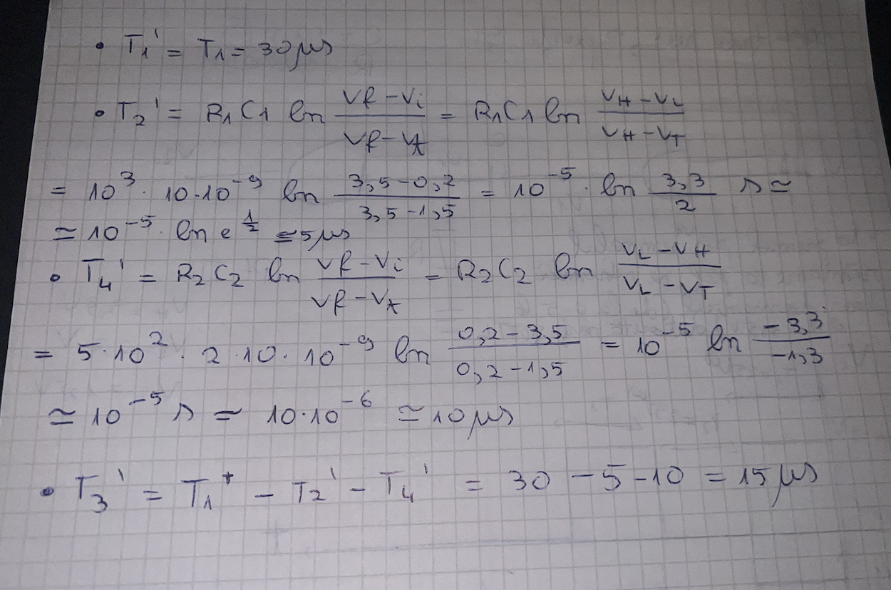

## Se cere ridicarea diagramelor de timp pentru diferite circuite si pentru un semnal de intrare de tip impuls

### Exemplul 1 (RC-trece-jos)
- Să se ridice diagramele de timp în $V_1, V_x, V_2$ pentru următorul circuit:
- 
- Ne dăm seama că punctul $V_x$ este distorsionat de un circuit RC-trece-jos, deoarece capacitorul este jos.
- 
- Pentru $V_i$ tensiunea poate fi $V_L=0V, V_H=3.5V$ sau $V_L = 0V, V_H = 5V$, dar după ce semnalul trece prin orice fel de poartă, ele fiind componente TTL, acesta este adus la valorile standard TTL $V_L = 0.2V, V_H = 3.5V$ cu tensiunea de prag $V_T = 1.5V$.
- Tabelul pentru poarta ``NAND`` este:

| A   | B   | F (rezultat) |
| --- | --- | ------------ |
| 0   | 0   | 1            |
| 0   | 1   | 1            |
| 1   | 0   | 1            |
| 1   | 1   | 0            |

### Exemplul 2 (RC-trece-sus)

### Exemplul 3

