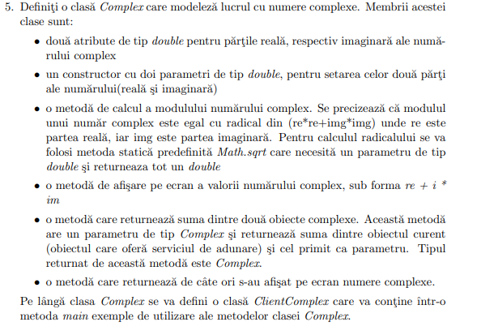

- ``Lab2/ClientComplex.java``
```java
package Lab2;

public class ClientComplex{

    public static void main(String args[]){
	Complex c = new Complex(2,3);
	c.Display();
    }
}

```

- ``Lab2/Complex.java``
```java
package Lab2;
public class Complex{
    private double img, real;
    private static int displayCount = 0;
    
    public Complex(double img, double real){
	this.img = img;
	this.real = real;
    }

    public double Mod(){
	return Math.sqrt(img*img+real*real);
    }

    public void Display(){
	System.out.println(img + "i" + "+ " + real);
	displayCount++;
    }

    public Complex Add(Complex b){
	return new Complex(img+b.img, real+b.real);
    }

    public static int GetDisplayCount(){
	return displayCount;
    }
    
}

```

- To run, use the following commands when inside the ``Lab2`` folder:
	- ``cd ..``
	- ``javac Lab2/ClientComplex.java Lab2/Complex.java``
	- ``java Lab2/ClientComplex``