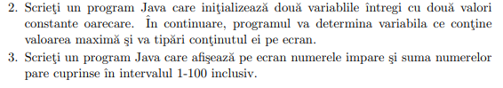

- ``Main.java``:
```java
public class Main {
	
	public static void main(String[] args){
		Exercise ex2 = new Ex2(), ex3 = new Ex3();
		ex2.printOutput();
		ex3.printOutput();
	}
}

interface Exercise{
	void printOutput();
}

class Ex2 implements Exercise{
	private final int a = 25;
	private final int b = 35;
	@Override
	public void printOutput() {
		if(a > b){
			System.out.println(a);
		}else{
			System.out.println(b);
		}
	}
}

class Ex3 implements Exercise{

	@Override
	public void printOutput() {
		int evenSum = 0;
		System.out.println("Odd numbers from 1 to 100:");
		for(int i = 1;i<=100;i++){
			if(i%2!=0){
				System.out.print(i + " ");
			}else{
				evenSum += i;
			}
		}
		System.out.println();
		System.out.println(evenSum);

	}
}

```

- To compile to JVM executable: ``jvc Main.java``
	-  To run the generated ``.class`` file use ``java Main``
- The command ``java`` also knows to directly 'interpret' it, so compile and run: ``java Main.java``. This, however, is recommended only for one-file interpreting, since interpreting a package that contains multiple files can cause some errors if the package wasn't compiled with ``jvc`` before.
	- Packages must be stored within a folder. For example, if we want to use ``package Lab1`` in our ``Main.java``, the file should be stored in the ``Lab1`` folder. The compile-and-run commands must be executed from the parent directory (the directory where ``Lab1`` folder is located within). 