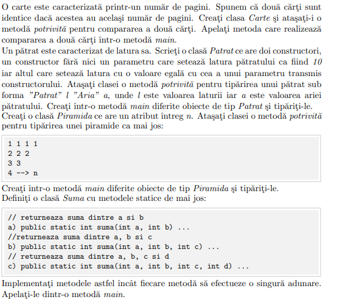
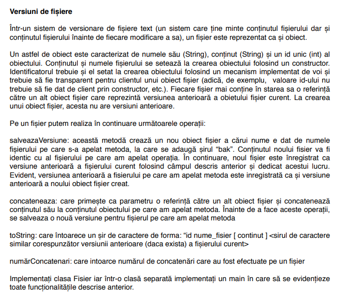

- ``Lab3/Exercise.java``
```java
public interface Exercise {
    void solveExercise();
}

```

- ``Lab3/Exercise1.java``
```java
class Book{
    private final int noPages;

    public Book(int noPages){
        this.noPages = noPages;
    }

    public boolean isIdentical(Book b){
        return this.noPages == b.noPages;
    }

}
public class Exercise1 implements Exercise
{
    @Override
    public void solveExercise() {
        System.out.println("------Exercise 1------");
        System.out.println(new Book(12).isIdentical(new Book(12)));
        System.out.println("----------------------");
    }
}

```

- ``Lab3/Exercise2.java``
```java
class Square{
    private final double side;
    public Square(){
        this.side = 10;
    }

    public Square(double side){
        this.side = side;
    }

    public void printArea(){
        System.out.println("Square with side " + side + " has area "+ side * side);
    }

}
public class Exercise2 implements Exercise{
    @Override
    public void solveExercise() {
        System.out.println("------Exercise 2------");
        new Square().printArea();
        new Square(12).printArea();
        System.out.println("----------------------");
    }
}

```

- ``Lab3/Exercise3.java``
```java
class Pyramid{
    private final int n;
    public Pyramid(int n){
        this.n = n;
    }

    public void displayPyramid(){
        for(int i=1;i<=n;i++){
            for(int j=1;j<=n-i+1;j++){
                System.out.print(i);
            }
            System.out.println();
        }
    }
}
public class Exercise3 implements Exercise{
    @Override
    public void solveExercise() {
        System.out.println("------Exercise 3------");
        new Pyramid(4).displayPyramid();
        System.out.println("----------------------");
    }
}

```

- ``Lab3/Exercise4.java``
```java
class Sum{
    public static int sumOfNumbers(int... numbers){
        int sum = 0;
        for(int number : numbers){
            sum += number;
        }
        return sum;
    }
}
public class Exercise4 implements Exercise{
    @Override
    public void solveExercise() {
        System.out.println("------Exercise 4-----");
        System.out.println(Sum.sumOfNumbers(1,2,3,4,5,6,7,8,9,10));
        System.out.println("----------------------");
    }
}

```




- ``Lab3/ExerciseFisier.java``
```java
class Fisier {
    private static int nextId = 1;
    private int id;
    private String nume;
    private String continut;
    private Fisier versiuneAnterioara;
    private int numarConcatenari;

    public Fisier getVersiuneAnterioara(){
        return versiuneAnterioara;
    }

    public Fisier(String nume, String continut) {
        this.id = nextId++;
        this.nume = nume;
        this.continut = continut;
        this.versiuneAnterioara = null;
        this.numarConcatenari = 0;
    }

    public void salveazaVersiune() {
        Fisier versiuneNoua = new Fisier(this.nume + "bak", this.continut);
        versiuneNoua.versiuneAnterioara = this.versiuneAnterioara;
        this.versiuneAnterioara = versiuneNoua;
    }

    public void concateneaza(Fisier altFisier) {
        salveazaVersiune();

        this.continut += altFisier.continut;
        this.numarConcatenari++;
    }

    @Override
    public String toString() {
        StringBuilder sb = new StringBuilder();
        sb.append(id).append(" ").append(nume).append(" [").append(continut).append("]");

        if (versiuneAnterioara != null) {
            sb.append(" <").append(versiuneAnterioara).append(">");
        }

        return sb.toString();
    }

    public int numarConcatenari() {
        return numarConcatenari;
    }
}

public class ExerciseFisier implements Exercise{
    @Override
    public void solveExercise() {
        Fisier fisier1 = new Fisier("document1", "Acesta este primul document.");
        System.out.println("Fișier inițial: " + fisier1);

        Fisier fisier2 = new Fisier("document2", " Acesta este un alt document.");
        System.out.println("Fișier secundar: " + fisier2);

        fisier1.concateneaza(fisier2);
        System.out.println("După concatenare: " + fisier1);

        System.out.println("Număr concatenări fisier1: " + fisier1.numarConcatenari());

        fisier1.salveazaVersiune();
        System.out.println("După salvarea unei noi versiuni: " + fisier1);

        fisier1.concateneaza(fisier2);
        System.out.println("După a doua concatenare: " + fisier1);

        System.out.println("Număr concatenări fisier1: " + fisier1.numarConcatenari());

        System.out.println();
        fisier2.salveazaVersiune();
        fisier2.salveazaVersiune();
        fisier2.salveazaVersiune();
        fisier2.salveazaVersiune();
        var fisier = fisier2;
        while(fisier != null){
            System.out.println(fisier);
            fisier = fisier.getVersiuneAnterioara();
        }
    }
}

```


- ``Main.java``
```java
import java.util.ArrayList;
import java.util.List;

public class Main {
    public static void main(String[] args) {

        var exercises = new ArrayList<Exercise>() {{
            add(new Exercise1());
            add(new Exercise2());
            add(new Exercise3());
            add(new Exercise4());
            add(new ExerciseFisier());
        }};

        for (var exercise : exercises) {
            exercise.solveExercise();
        }

    }
}
```
