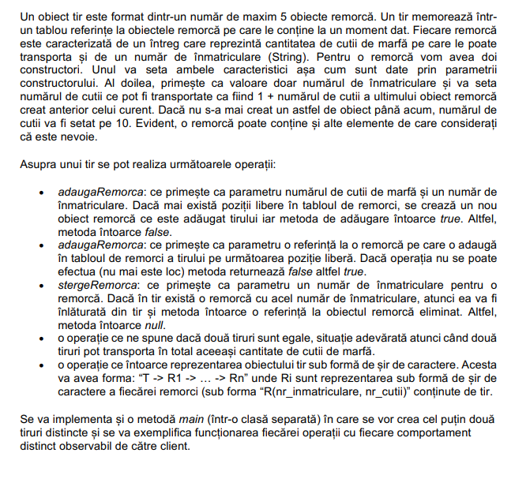

- ``Lab4/Remorca.java``
```java
package Lab4;
public class Remorca{
    private int nrCutii;
    private static int nrCutiiAnterioare = 0;
    private String nrInmatriculare;

    public int getNrCutii(){
		return nrCutii;
    }

    public String getNrInmatriculare(){
		return nrInmatriculare;
    }
    
    public Remorca(int nrCutii, String nrInmatriculare){
		this.nrCutii = nrCutii;
		nrCutiiAnterioare = nrCutii;
		this.nrInmatriculare = nrInmatriculare;
    }

    public Remorca(String nrInmatriculare){
		this.nrInmatriculare = nrInmatriculare;
		nrCutii = nrCutiiAnterioare == 0 ? 10 : nrCutiiAnterioare + 1;
		nrCutiiAnterioare = nrCutii;
    }
}

```

- ``Lab4/Tir.java``
```java
package Lab4;
public class Tir{
    private Remorca[] remorci;
    private int nrRemorci;
    private final int NR_MAX_REMORCI = 5;

    public int getNrRemorci(){
		return nrRemorci;
    }

    public Remorca[] getRemorci(){
		return remorci;
    }
    
    public Tir(){
		nrRemorci = 0;
		remorci = new Remorca[NR_MAX_REMORCI];
    }

    public boolean adaugaRemorca(int nrCutii, String nrInmatriculare){
		if(nrRemorci < NR_MAX_REMORCI){
		    remorci[nrRemorci++] = new Remorca(nrCutii, nrInmatriculare);
		    return true;
		}
		return false;
    }

    public boolean adaugaRemorca(Remorca remorca){
		if(nrRemorci < NR_MAX_REMORCI){
		    remorci[nrRemorci++] = remorca;
		    return true;
		}
		return false;
    }

    public Remorca stergeRemorca(String nrInmatriculare){
		for(int i=0; i < nrRemorci; i++){
		    if(remorci[i].getNrInmatriculare().equals(nrInmatriculare)){
			Remorca tmp = remorci[i];
			for(int j=i+1; j < nrRemorci; j++){
			    remorci[j-1] = remorci[j];
			}
			nrRemorci--;
			return tmp;
		    }
		}
		return null;
    }

    @Override
    public boolean equals(Object tirObj){
		if(tirObj instanceof Tir){
		    return false;
		}
		
		Tir tir = (Tir)tirObj;
		
		int s1 = 0, s2 = 0;
		for(int i=0; i<nrRemorci; i++){
		    s1 += remorci[i].getNrCutii();
		}
		Remorca[] remorciTir2 = tir.getRemorci();
		for(int i=0; i<tir.getNrRemorci(); i++){
		    s2 += remorciTir2[i].getNrCutii();
		}
	
		return s1 == s2;
    }

    @Override
    public String toString(){
		String result = "T -> ";
		for(int i=0; i<nrRemorci; i++){
		    result += "R(" + remorci[i].getNrInmatriculare() +
			", " + remorci[i].getNrCutii() + ") ";
		    if(i != nrRemorci-1){
				result += "-> ";
		    }
		}
		return result;
    }
};

```

- ``Lab4/Main.java``
```java
package Lab4;
public class Main{
    public static void main(String[] args){
		Tir t1 = new Tir();
		t1.adaugaRemorca(12, "DJ04AAI");
		t1.adaugaRemorca(12, "DJ05AAI");
	
		Tir t2 = new Tir();
		Remorca r = new Remorca(15, "TM05ABA");
		t1.adaugaRemorca(r);
		t2.adaugaRemorca(r);
		
		System.out.println(t1);
		t1.stergeRemorca("DJ05AAI");
		System.out.println(t1);
		
		System.out.println(t2);
    }
}

```

- To run, use the following commands when inside the ``Lab4`` folder:
	- ``cd ..``
	- ``javac Lab4/Remorca.java Lab4/Tir.java Lab4/Main.java``
	- ``java Lab4/Main``