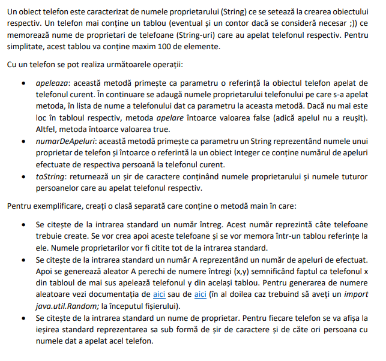

- ``Lab5/Telefon.java``
```java
package Lab5;

public class Telefon{
    private final int NR_MAX_AGENDA = 100;
    
    private String numeProprietar;
    private String[] agenda;
    private int agendaSize = 0;

    public void addToAgenda(String nume){
	agenda[agendaSize++] = nume;
    }

    public int getAgendaSize(){
	return agendaSize;
    }
    
    public Telefon(String numeProprietar){
	this.numeProprietar = numeProprietar;
	agenda = new String[NR_MAX_AGENDA];
    }

    public boolean apeleaza(Telefon telefon){	
	if(telefon.agendaSize == NR_MAX_AGENDA){
	    return false;
	}
        telefon.addToAgenda(numeProprietar);
	return true;
    }

    public Integer numarDeApeluri(String nume){
	Integer nr = 0;
	for(int i = 0; i<agendaSize; i++){
	    if(agenda[i].equals(nume)){
		nr++;
	    }
	}
	return nr;
    }

    @Override
    public String toString(){
	String apelanti = "";
        for(int i = 0; i<agendaSize; i++){
	    apelanti += agenda[i] + " ";
	}
	return numeProprietar + " -> " + apelanti;
    }
}

```

- ``Lab5/Main.java``
```java
package Lab5;
import java.util.Scanner;
import java.util.Random;

public class Main{
    public static void main(String[] args){
	var rand = new Random();
	
	Scanner s = new Scanner(System.in);
	int n = s.nextInt();
	s.nextLine();

	var telefoane = new Telefon[n];
	
	for(int i=0; i<n; i++){
	    String nume = s.nextLine();
	    telefoane[i] = new Telefon(nume);
	}

	int a = s.nextInt();
	s.nextLine();
	
	for(int i=0; i<a; i++){
	    int x = rand.nextInt(n);
	    int y = rand.nextInt(n);

	    telefoane[x].apeleaza(telefoane[y]);
	}

	String nume = s.nextLine();
	System.out.println(nume);
	for(int i=0; i<n; i++){
	    System.out.println(telefoane[i] + " " + telefoane[i].numarDeApeluri(nume));
	}

     
    }
}

```

- To run, use the following commands when inside the ``Lab5`` folder:
	- ``cd ..``
	- ``javac Lab5/Telefon.java Lab5/Main.java``
	- ``java Lab5/Main``