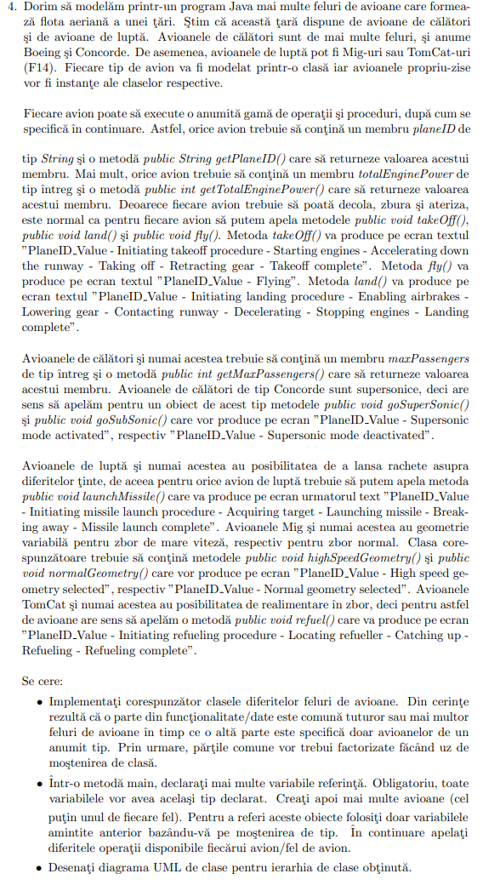

```Java
class Plane{
    private String planeId;
    private int totalEnginePower;
    
    public String getPlaneId(){
	return planeId;
    }

    public int getTotalEnginePoiwer(){
	return totalEnginePower;
    }

    public Plane(String planeId, int totalEnginePower){
	this.planeId = planeId;
	this.totalEnginePower = totalEnginePower;
    }

    public void takeOff(){
	System.out.println(planeId + " - takeoff");
    }

    public void fly(){
	System.out.println(planeId + " - flying");
    }

    public void land(){
	System.out.println(planeId + " - landed");
    }
}

class PassengerPlane extends Plane{
    private int maxPassengers;

    public int getMaxPassengers(){
	return maxPassengers;
    }
    
    public PassengerPlane(String planeId, int totalEnginePower, int maxPassengers){
	super(planeId, totalEnginePower);
	this.maxPassengers = maxPassengers;
    }
    
}

class ConcordePlane extends PassengerPlane{
    public ConcordePlane(String planeId, int totalEnginePower, int maxPassengers){
	super(planeId, totalEnginePower, maxPassengers);
    }

    public void goSuperSonic(){
	System.out.println(super.getPlaneId() + " - supersonic mode activated");
    }

    public void goSubSonic(){
	System.out.println(super.getPlaneId() + " - supersonic mode deactivated");
    }

}

class FighterPlane extends Plane{
    public FighterPlane(String planeId, int totalEnginePower){
	super(planeId, totalEnginePower);
    }
    
    public void launchMissle(){
	System.out.println(super.getPlaneId() + " - launched missle");
    }

}

class MigPlane extends FighterPlane{
    public MigPlane(String planeId, int totalEnginePower){
	super(planeId, totalEnginePower);
    }
    
    public void highSpeedGeometry(){
	System.out.println(super.getPlaneId() + " - high speed geometry");
    }

    public void normalGeometry(){
	System.out.println(super.getPlaneId() + " - normal geometry");
    }
}

class TomCatPlane extends FighterPlane{
    public TomCatPlane(String planeId, int totalEnginePower){
	super(planeId, totalEnginePower);
    }
    
    public void refuel(){
	System.out.println(super.getPlaneId() + " - refuel");
    }
}

public class Main{

    public static void main(String args[]){
	Plane tomCat  = new TomCatPlane("1", 14),
	      mig     = new MigPlane("2", 152),
	      fighter = new FighterPlane("3", 120),
	      conc    = new ConcordePlane("4", 500, 420),
	      pass    = new PassengerPlane("5", 120, 300);

	((TomCatPlane)tomCat).refuel();
	((TomCatPlane)tomCat).launchMissle();
	
	((MigPlane)mig).highSpeedGeometry();
	((MigPlane)mig).normalGeometry();
	((MigPlane)mig).launchMissle();

	((FighterPlane)fighter).launchMissle();

	((ConcordePlane)conc).goSuperSonic();
	((ConcordePlane)conc).goSubSonic();
	System.out.println(((ConcordePlane)conc).getMaxPassengers());

	System.out.println(((PassengerPlane)pass).getMaxPassengers());
	    
    }
    
}
```