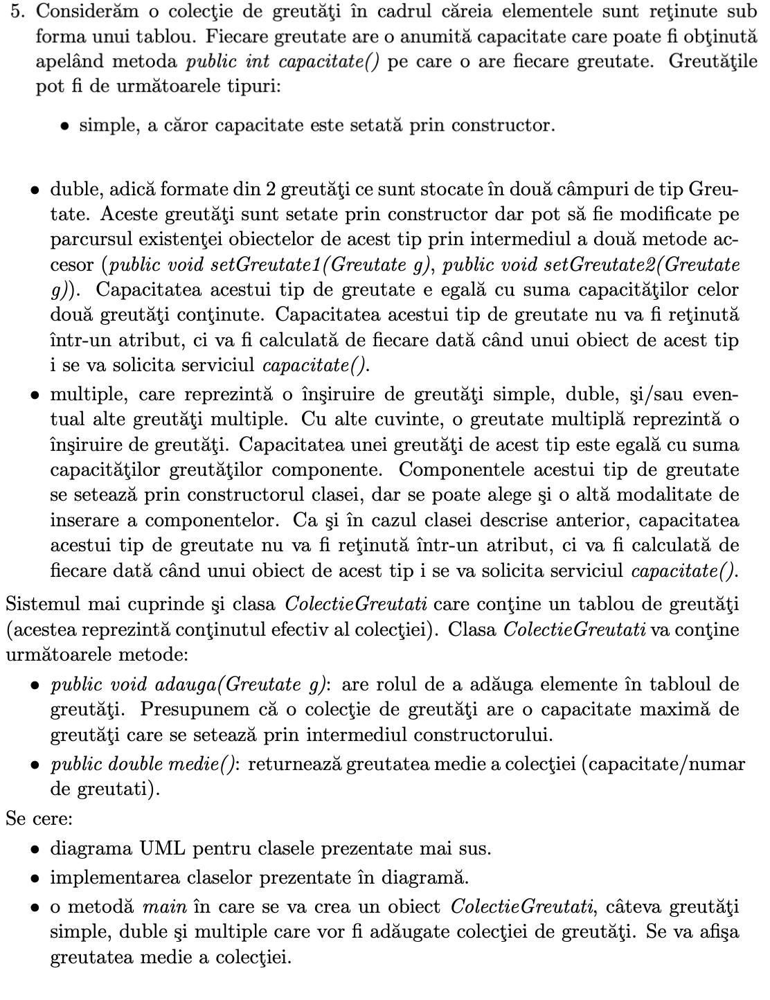

- ``Weight.java``
```java
import java.util.ArrayList;  
  
public abstract class Weight {  
    protected ArrayList<Integer> weightValues = new ArrayList<>();  
  
    public abstract Integer capacity();  
}
```

- ``SimpleWeight.java``
```java
import java.util.ArrayList;  
  
public class SimpleWeight extends Weight{  
    public SimpleWeight(Integer weightValue){  
        weightValues.add(weightValue);  
    }  
  
    @Override  
    public Integer capacity() {  
        return weightValues.get(0);  
    }  
}
```

- ``DoubleWeight.java``
```java
public class DoubleWeight extends Weight{  
    public DoubleWeight(Integer weightValue1, Integer weightValue2){  
        weightValues.add(weightValue1);  
        weightValues.add(weightValue2);  
    }  
  
    public void setWeightValue1(Integer weightValue1){  
        weightValues.set(0, weightValue1);  
    }  
  
    public void setWeightValue2(Integer weightValue2){  
        weightValues.set(1, weightValue2);  
    }  
  
    @Override  
    public Integer capacity() {  
        return weightValues.get(0) + weightValues.get(1);  
    }  
}
```

- ``MultipleWeight.java``
```java
import java.util.ArrayList;  
  
public class MultipleWeight extends Weight{  
    public MultipleWeight(ArrayList<Integer> weights){  
        weightValues = weights;  
    }  
  
    @Override  
    public Integer capacity() {  
        var result = 0;  
        for (var value : weightValues) {  
            result += value;  
        }  
        return result;  
    }  
}
```

- ``WeightCollection.java``
```java
import java.util.ArrayList;  
  
public class WeightCollection {  
    private final ArrayList<Weight> weights = new ArrayList<>();  
  
    public void addWeightToCollection(Weight w) {  
        weights.add(w);  
    }  
  
    public double calculateAverageWeightValue(){  
        var s = 0f;  
        for(var w: weights){  
            s += w.capacity();  
        }  
        s /= weights.size();  
  
        return s;  
    }  
  
}
```

- ``Main.java``
```java
import java.util.ArrayList;  
import java.util.Arrays;  
  
public class Main {  
    public static void main(String[] args) {  
        WeightCollection wc = new WeightCollection();  
  
        wc.addWeightToCollection(new SimpleWeight(10));  
        wc.addWeightToCollection(new DoubleWeight(30, 20));  
        wc.addWeightToCollection(new MultipleWeight(new ArrayList<>(Arrays.asList(40,50,60))));  
  
        System.out.println(wc.calculateAverageWeightValue());  
    }  
}
```