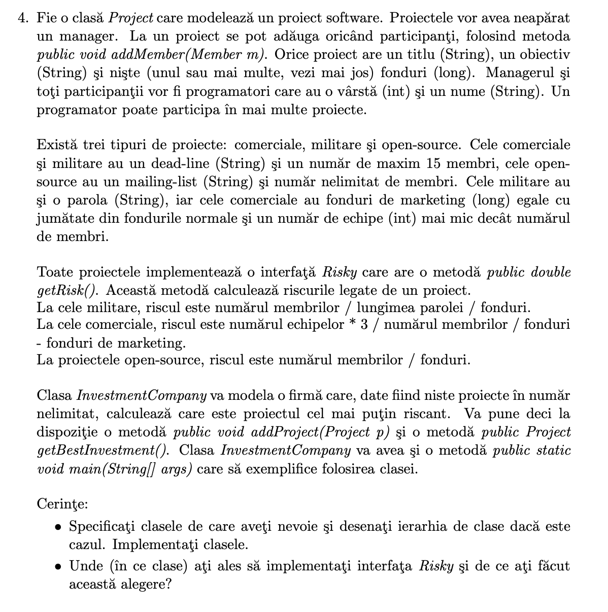

- ``Role.java``
```java
public enum Role {  
    EMPLOYEE, MANAGER  
}
```

- ``Member.java``
```java
public class Member {  
    private final String name;  
    private int age;  
    private Role role;  
  
    public Member(String name, Role role, int age){  
        this.role = role;  
        this.name = name;  
        this.age = age;  
    }  
  
    public String getName() {  
        return name;  
    }  
  
    public Role getRole() {  
        return role;  
    }  
  
    public int getAge() {  
        return age;  
    }  
  
    public void setAge(int age) {  
        this.age = age;  
    }  
  
    public boolean promoteToManager(){  
        if(role == Role.MANAGER){  
            return false;  
        }else{  
            role = Role.MANAGER;  
            return true;        }  
    }  
}
```

- ``IProject.java``
```java
import java.util.ArrayList;  
import java.util.List;  
  
public abstract class IProject {  
    private Member manager;  
    protected final ArrayList<Member> members = new ArrayList<>();  
    protected String title;  
    protected String objective;  
    protected long funds;  
  
    protected IProject(Member manager, String title, String objective, long funds){  
        this.manager = manager;  
        this.title = title;  
        this.objective = objective;  
        this.funds = funds;  
    }  
  
    public ArrayList<Member> getMembers(){  
        return this.members;  
    }  
  
    public Member getManager(){  
        return this.manager;  
    }  
  
    protected void changeManager(Member m){  
        this.manager = m;  
    }  
  
    abstract void addMember(Member m);  
  
    abstract double getRisk();  
  
}
```

- ``CommercialProject.java``
```java
import java.util.Calendar;  
import java.util.Date;  
  
public class CommercialProject extends IProject{  
    private final int no_max_members = 15;  
    private Date deadline;  
    private long marketingFunds;  
  
    public CommercialProject(Member manager, String title, String objective, long funds, Date deadline) {  
        super(manager, title, objective, funds);  
        this.deadline = deadline;  
        marketingFunds = funds / 2;  
    }  
  
    public void updateDeadline(int noDays){  
        Calendar cal = Calendar.getInstance();  
        cal.setTime(deadline);  
        cal.add(Calendar.DATE, noDays);  
        deadline = cal.getTime();  
    }  
  
    public Date getDeadline(){  
        return deadline;  
    }  
  
    public long getMarketingFunds(){  
        return marketingFunds;  
    }  
  
    @Override  
    void addMember(Member m) {  
        if(members.size() < no_max_members){  
            members.add(m);  
        }  
    }  
  
    @Override  
    double getRisk() {  
        return (double)members.size() * 3 + funds;  
    }  
}
```


- ``MilitaryProject.java``
```java
import java.util.Date;  
  
public class MilitaryProject extends IProject{  
    private final Date deadline;  
    private final int no_max_members = 15;  
    private String password;  
  
    public MilitaryProject(Member manager, String title, String objective, long funds, Date deadline, String password) {  
        super(manager, title, objective, funds);  
        this.deadline = deadline;  
        this.password = password;  
    }  
  
    public Date getDeadline(){  
        return deadline;  
    }  
  
    @Override  
    void addMember(Member m) {  
        if(members.size() < no_max_members){  
            members.add(m);  
        }  
    }  
  
    @Override  
    double getRisk() {  
        return members.size() * password.length();  
    }  
}
```

- ``OpenSourceProject.java``
```java
public class OpenSourceProject extends IProject{  
    public OpenSourceProject(Member manager, String title, String objective, long funds) {  
        super(manager, title, objective, funds);  
    }  
  
    @Override  
    void addMember(Member m) {  
        members.add(m);  
    }  
  
    @Override  
    double getRisk() {  
        return (double) members.size() / funds;  
    }  
}
```

- ``InvestmentCompany.java``
```java
import java.time.LocalDate;  
import java.util.ArrayList;  
  
public class InvestmentCompany {  
    private static ArrayList<IProject> projects = new ArrayList<>();  
    public static void addProject(IProject project){  
        projects.add(project);  
    }  
  
    public static IProject getBestInvestment(){  
        if(projects.size() == 0){  
            return null;  
        }  
  
        double bestInvestment = projects.get(0).getRisk();  
        IProject projectResult = projects.get(0);  
  
        for(int i=1; i<projects.size(); i++){  
            if(projects.get(i).getRisk() < bestInvestment){  
                bestInvestment = projects.get(i).getRisk();  
                projectResult = projects.get(i);  
            }  
        }  
  
        return projectResult;  
    }  
  
    public static void main(String[] args) {  
  
        var manager = new Member("John Doe", Role.MANAGER, 44);  
  
        var dev1 = new Member("Dev1", Role.EMPLOYEE, 19);  
        var dev2 = new Member("Dev2", Role.EMPLOYEE, 20);  
        var dev3 = new Member("Dev3", Role.EMPLOYEE, 21);  
  
        var militaryProject = new MilitaryProject(manager, "Military", "Destory enemy", 1000, java.sql.Date.valueOf(LocalDate.now()), "123");  
        militaryProject.addMember(dev1);  
        militaryProject.addMember(dev2);  
  
        var commercialProject = new CommercialProject(manager, "Commerial", "Wordpress site", 123, java.sql.Date.valueOf(LocalDate.now()));  
        commercialProject.addMember(dev3);  
  
        var openSourceProject = new OpenSourceProject(manager, "Military", "Destory enemy", 1000);  
        openSourceProject.addMember(dev1);  
  
        addProject(militaryProject);  
        addProject(commercialProject);  
        addProject(openSourceProject);  
  
        var bestInvestment = getBestInvestment();  
        System.out.println(bestInvestment != null ? bestInvestment.title : "no project");  
    }  
}
```