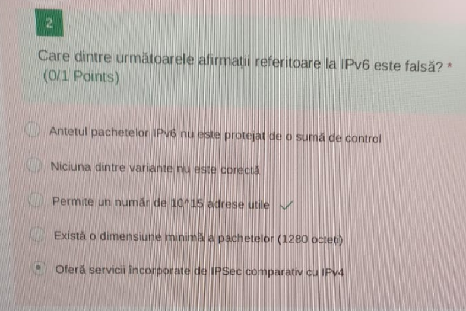
- IPv6 folosește 128 biți, deci numărul de adrese totale este ``2^128``. Din acestea 2 sunt rezervate pentru adresa de rețea și cea de broadcast, deci numărul de adrese utilizabile este ``2^128 - 2``
- O dimensiune minimă a pachetelor există, dar de 40 bytes, deoarece acesta este dimensiunea minimă a unui header IPv6, payload-ul (body) în acest caz fiind de 0 bytes.
- ``IPSec`` este o suită de protocoale folosită pentru a asigura securitatea comunicațiilor prin ``IP``. Ea este construită direct în protocolul IPv6 și oferă aplicațiilor varianta folosirii acesteia. În IPv4 ea poate fi folosită, dar este implicit opțională.
---

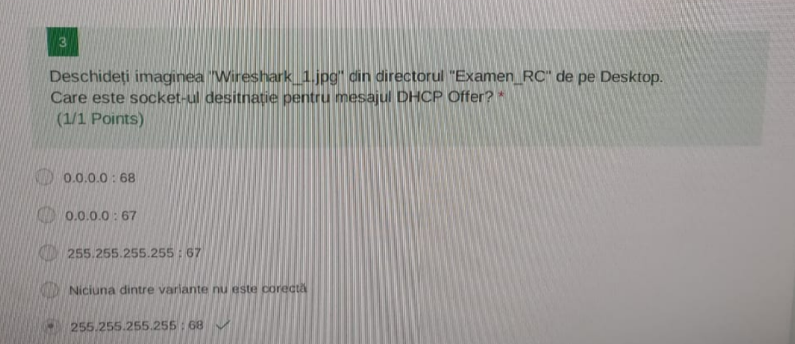

- Exemplu de imagine:
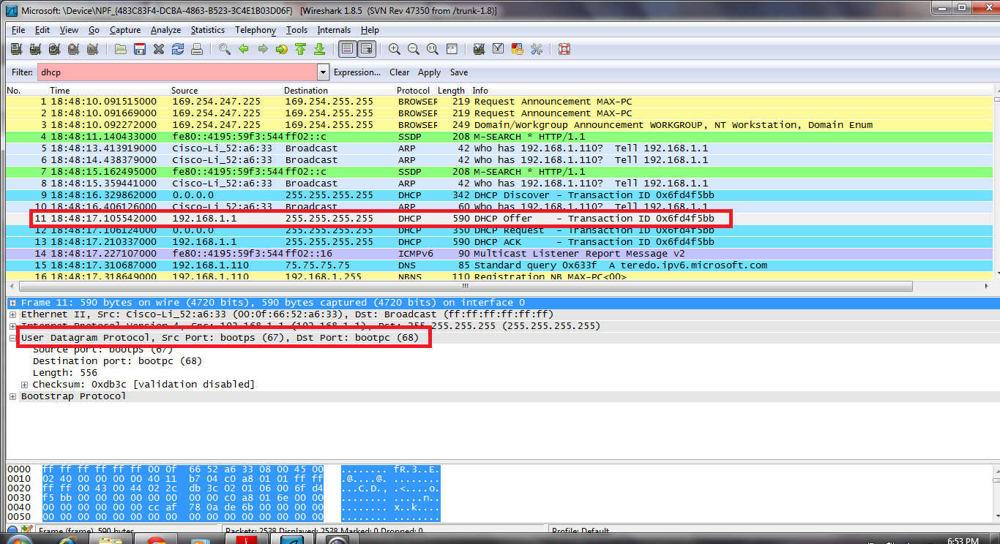

---

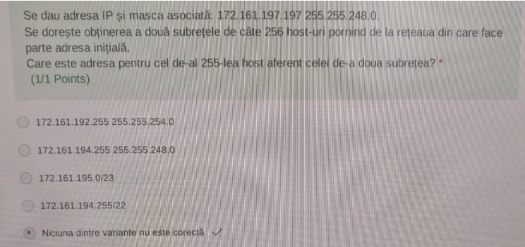
- După ce am efectuat ȘI logic între adresa IP si masca asociată, aflăm adresa rețelei: ``172.161.192.0/21``. Pentru a continua procesul de subnetare cu mască fixă trebuie să stabilim masca celor două subrețele. 
- Dacă nu am fi avut nicio restricție din punct de vedere al numărului de host-uri, am fi folosit un număr minim de biți pentru identificarea subrețelelor, în acest caz unul singur, deoarece avem doar două subrețele. În acest caz masca ar fi fost ``22``, iar adresele celor două subrețele ``172.161.192.0/22`` respectiv ``172.161.224.0/22``
- Totuși, datorită restricției numărului de host-uri, vom alege masca ``24`` care ne lasă 8 biți pentru partea de host, deci fix ``2^8 = 256`` host-uri. Astfel, prima rețea are adresa ``172.161.192.0/24``, iar cea de a doua ``172.161.193.0/24``, iar cel de-al 255-lea host aferent pentru a doua rețea este ``172.161.193.254/24``
---

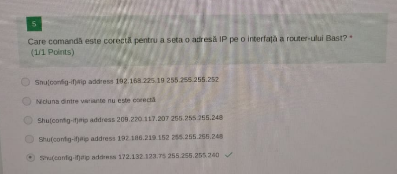

- a) Adresa de rețea pentru adresa IP ``192.167.225.19/30`` este ``192.167.225.16/30``, adresa de broadcast fiind chiar ``192.167.225.19/30``, deci comanda nu va funcționa
- c) comanda nu va funcționa pentru ca este adresa de broadcast
- d) comanda nu fa funcționa pentru ca este adresa de rețea

--- 

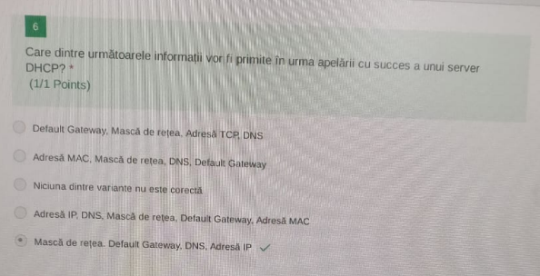

- a) Nu există termenul de adresă TCP
- b) Lipsește adresa IP, iar adresa MAC nu este întoarsă de serverul DHCP
- d) Adresa MAC nu este întoarsă de serverul DHCP 

--- 

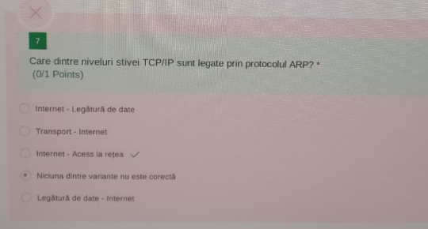

- Protocolul ``ARP`` este folosit pentru găsirea adresei MAC asociate unei adrese IP

---

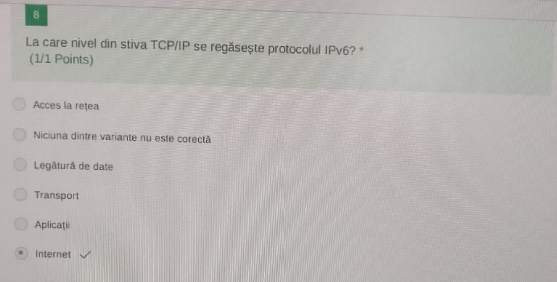

---

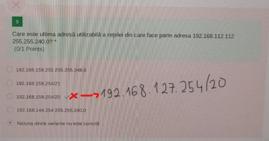

```
Adresa retelei = 192.168.112.112 &(pe grupe) 255.255.240.0 = 192.168.X.0
X = 112 & 240
      2^7 2^6 2^5 2^4 2^3 2^2 2^1 2^0
240 =  1   1   1   1   0   0   0   0
112 =  0   1   1   1   0   0   0   0
-------------------------------------- &
X   =  0   1   1   1   0   0   0   0 = 112

=> Adresa retelei = 192.168.112.0/20 (deoarece 20 de biti sunt rezervaru pentru partea de retea)
Ultima adresa utilizabila = Adresa de broadcast - 1
Adresa de broadcast = punem toti bitii rezervati pentru partea de host pe 1 in adresa retelei. Din al treilea octet avem 4 biti pentru partea de host (deci 01111111), iar ultimul octet este rezervat integral pentru host.
=> Adresa de broadcast = 192.168.127.255
=> Ultima adresa utilizabila = 192.168.127.254
```

---

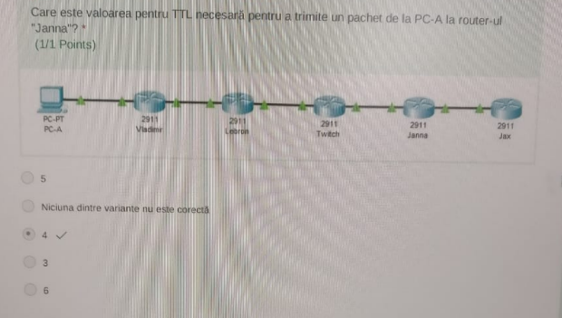
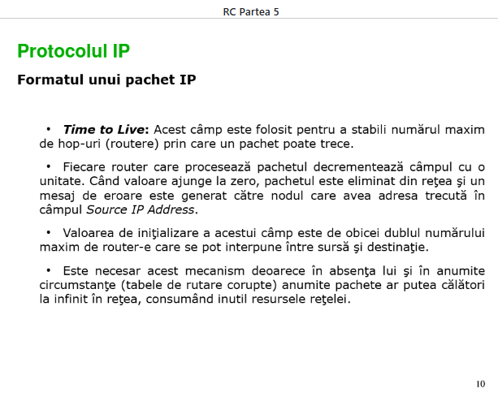
- Este suficient să numărăm muchiile dintre noduri pentru a determina TTL minim pentru ca un pachet să ajungă de la un nod la altul.

---

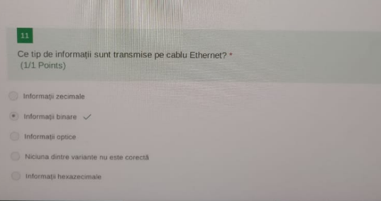

---

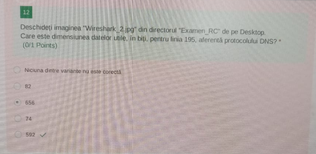
- Dimensiunea utilă este doar cea a body-ului, adică dimensiunea totală a pachetului minus dimensiunea header-ului.

---

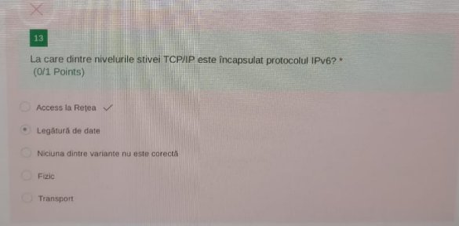

---

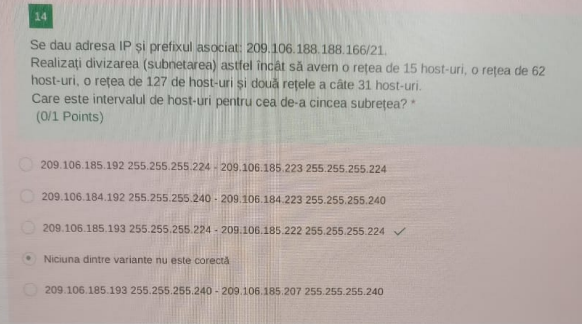

```
Aro = Adresa retelei originale = 209.106.188.166 & 255.255.248.0
Aro = 209.106.X.0


X = 248 & 188
      2^7 2^6 2^5 2^4 2^3 2^2 2^1 2^0
188 =  1   0   1   1   1   1   0   0
248 =  1   1   1   1   1   0   0   0
-------------------------------------- &
X   =  1   0   1   1   1   0   0   0 = 184

=> Aro = 209.106.184.0

* Subnetarea VLSM se realizeaza in ordine descrescatoare a numarului de host-uri.

1. 127 host-uri => 127+2(broadcast,retea)=129 adrese => 8 biti host => 32-8=24 biti retea
Ar1 = 209.106.10111000.|00000000/24

2. 62 host-uri => 62+2=64 adrese => 6 biti host => 32-6=26 biti retea
Ar2 = 209.106.10111001.00|000000/26 (am diferentiat de Ar1 incrementand cu 1 partea comuna cu Ar1)

3. 31 host-uri => 31+2=33 adrese => 6 biti host => 32-6=26 biti retea
Ar3 = 209.106.10111001.01|000000/26

4. 31 host-uri => 31+2=33 adrese => 6 biti host => 32-6=26 biti retea
Ar4 = 209.106.10111001.10|000000/26

5. 15 host-uri => 15+2=17 adrese => 5 biti host => 32-5=27 biti retea
Ar5 = 209.106.10111001.110|00000/27

=> Ar5 (adresa retelei 5) = 209.106.185.192/27
Ni se cere intervalul de host, deci [adresa retea+1, adresa broadcast-1]
=> Adresa retea+1 = 209.106.185.193/27

Adresa broadcast (punem toti bitii de host pe 1, deci ultimii 5 biti) = 209.106.10111001.110|11111/27 = 209.106.185.223/27
=> Adresa broadcast-1 = 209.106.185.222/27

Deci raspunsul c este corect deoarece '/27' este echivalent cu masca de retea 255.255.255.224

```

---


- Secvența completă de mesaje pentru încheierea unei conexiuni TCP:
	1. Client -> Server: ``FIN``
	2. Server -> Client: ``ACK``
	3. Server -> Client: ``FIN``
	4. Client -> Server: ``ACK``

---

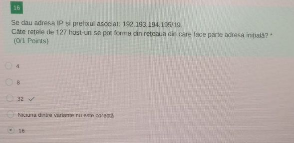
- Avem 19 biți rezervați pentru rețea, 32-19=13 biți pentru host. 
- 127 host-uri => 127+2=129 adrese => avem nevoie de 8 biți pentru partea de host a fiecărei rețele subnetate
- 13-8=5 biți rămași din care putem împrumuta pentru subnetare => maxim ``2^5 = 32``  rețele

---

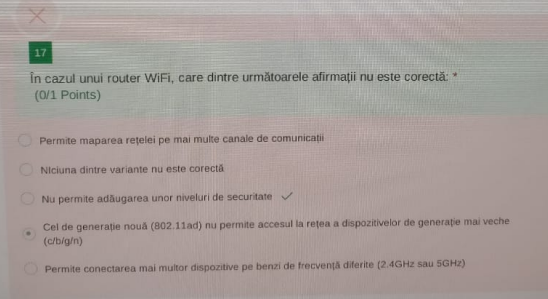
- Afirmația este adevărată deoarece routerele nu pot adăuga niveluri de securitate dispozitivelor care nu le suportă (ex: WPA3 pentru dispozitive vechi). Compatibilitatea inversă impune utilizarea unor protocoale mai vechi, iar securitatea trebuie configurată manual de utilizator, routerul neputând face acest lucru automat.

---

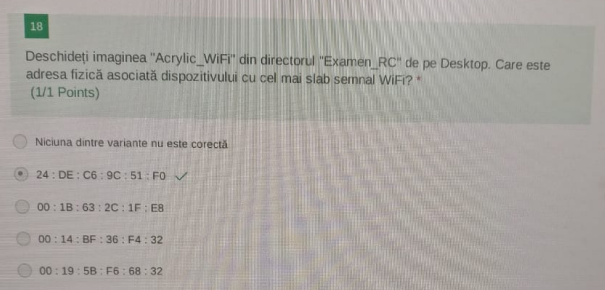

---

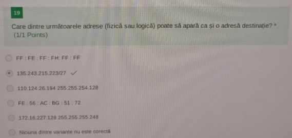
- a) Conține ``H``, iar baza de numerație hexazecimal are doar caracterele ``0-9``, ``A-F``
- b) ``135.243.215.223/27`` este adresa broadcast care poate apărea ca și adresă de destinație (înseamnă că pachetul va fi trimis catre toate dispozitivele dintr-o rețea)
	- Demonstrație
```
Ar = 135.243.215.223 & 255.255.255.11100000
Ar = 135.243.215.X

X = 223 & 11100000
      2^7 2^6 2^5 2^4 2^3 2^2 2^1 2^0
223 =  1   1   0   1   1   1   1   1
       1   1   1   0   0   0   0   0
-------------------------------------- &
X   =  1   1   0   0   0   0   0   0 = 192

=> Ar = 135.243.215.192
Adresa broadcast (punem toti bitii de host pe 1) = 135.243.215.11011111 = 135.243.215.223/27
```
- c) Masca de rețea este incorectă, deoarece nu poate apărea un 1 după 0 în reprezentarea ei în binar.
- d) Conține ``G``, iar baza de numerație hexazecimal are doar caracterele ``0-9``, ``A-F``
- e) ``172.16.227.128`` este adresa rețelei, iar un pachet nu poate avea ca și destinație tot rețeaua, el plecând din rețea. Pachetele IP sunt trimise către dispozitive specifice din rețea. Un pachet pleacă din rețea pentru a ajunge la o adresă individuală (host), iar adresa de rețea este folosită doar pentru identificare în rutare, nu pentru comunicare directă.
	- Demonstrație:
```
Ar = 172.16.227.128 & 255.255.255.248
Ar = 172.16.227.X


X = 128 & 248
      2^7 2^6 2^5 2^4 2^3 2^2 2^1 2^0
128 =  1   0   0   0   0   0   0   0
248 =  1   1   1   1   1   0   0   0
-------------------------------------- &
X   =  1   0   0   0   0   0   0   0 = 128

=> Ar = 172.16.227.128
```

--- 

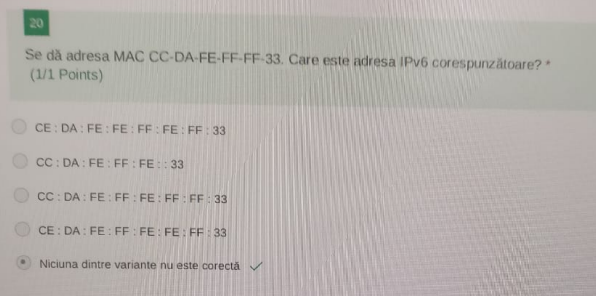
- Nu putem ajunge de la adresa ``MAC`` la adresa ``IPv6``, ci invers folosindu-ne de protocolul ``ND (Neighbour Discovery Protocol)``, iar în cazul ``IPv4`` de protocolul ``ARP (Address Resolution Protocol)``.

---


