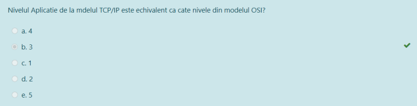

```
Aro (adresa retea originala) = 192.168.10.0/24
24 biti rezervati pentru partea de retea => 8 biti rezervati pentru partea de host
Pentru subnetare ne vom imprumuta de la bitii de host.

Ne dorim subnetare in 4 subretele => avem nevoie de 2 biti pentru a le diferentia
=> Masca subretelelor (bitii rezervati pentru partea de retea) va fi 24+2=26, ramanandu-ne 32-26=6 biti pentru partea de host a fiecarei subretele.
=> 2^6-2(rezervat pentru adresa retelei si adresa de broadcast) = 64-2 = 62 (numarul maxim de host-uri al fiecarei subretele).
Daca ni se cere a X-a adresa din subretea, unde X > 62, orice raspuns va fi gresit.

1. Ar1 = (adresa subretelei 1)
   Ar1 = 192.168.10.00|000000/26
2. Ar2 = 192.168.10.01|000000/26
3. Ar3 = 192.168.10.10|000000/26
4. Ar4 = 192.168.10.11|000000/26

=> Ar3 = 192.168.10.128/26
A 54-a adresa IP disponibila din r3 este Ar3 + 54 = 192.168.10.182/26

Pentru a afla Ab3 (adresa de broadcast a subretelei3) punem toti bitii rezervati pentru partea de host, adica ultimii 6 biti ai lui Ar3 pe 1.
=> Ab3 = 192.168.10.X, unde X = 255-64(pt ca doar bitul al doilea ramane pe 0) = 191
=> Ab3 = 192.168.10.191/26

```

---


- Routerele conectate intre ele nu au domenii de coliziune = 2 muchii
- Restul conexiunilor (router-switch, switch-switch, switch-pc) au = 7 muchii
	- Fiecare port al switch-ului(orice conexiune la acel switch) are un domeniu de coliziune, deci in diagrama noastră avem un domeniu de coliziune pentru fiecare PC, adică 4 și un domeniu de coliziune pentru fiecare conectare router-switch, adică 2
	- Similar, conectarea celor două switch-uri intre ele creează un domeniu de coliziune. Conectarea celor două switch-uri intre ele, deși ele sunt conectate și la routere permite extinderea rețelei LAN.
	- Conexiunile router-router nu reprezintă un domeniu de coliziune

---


```
Adresa ultimului host = Abr(adresa de broadcast) - 1
      2^7 2^6 2^5 2^4 2^3 2^2 2^1 2^0
164 =  1   0   1   0   0   1   0   0
254 =  1   1   1   1   1   1   1   0

=> Ar (adresa retea) = 172.28.1010010|0.00000000/23
=> Abr               = 172.28.1010010|1.11111111/23 = 172.28.165.255

=> Adresa ultimului host = 172.28.165.255 - 1 = 172.28.165.254

```

---


- Adevărat, deoarece pachetul trimis trece prin mai multe rețele intermediare înainte de a ajunge la rețeaua țintă, fiecare rețea având dispozitivele ei conectate, cu adrese MAC diferite.

---


---


---


---


---


---


---



---


- Routerul conectează rețele între ele

---


---


- Cele două PC-uri nu au nicio muchie de conexiune între ele

---


- 5Mbps = 5 Mega biți pe secundă = ``5 * 10^6`` biți / secundă => 1 bit va fi transferat în ``1/(5*10^6)`` = ``1/5 * 10^(-6)`` secunde = 1/5 microsecunde = 0,2 microsecunde

---


- Comanda "tracert/traceroute/..." ne permite urmărirea drumului parcurs de un pachet IP.

---


- Diensiunea totală a pachetelor este 151 octeți, iar lungimea body-urilor (len) este 97 octeți, ceea ce înseamnă că dimensiunea antetelor este 151-97 = 54 octeți

---


---


---


---


---


- OSPF ține cont de costul muchiilor
	- R1-R4-R5-R6-PC = 10+20+15+30+10 = 85
	- R1-R4-R6-PC =10+20+40+10 = 80
	- R1-R2-R3-R6-PC = 10+20+15+20+10 = 75


---


---


---


```
Ar (adresa retea) = Adresa IP & Masca retea
'/23' = 255.255.11111110.00000000 
=> Ar = 172.28.144.59 & 255.255.11111110.00000000 = 172.28.X.0
X = 144 & 11111110

      2^7 2^6 2^5 2^4 2^3 2^2 2^1 2^0
144 =  1   0   0   1   0   0   0   0
       1   1   1   1   1   1   1   0
-------------------------------------- &
X   =  1   0   0   1   0   0   0   0 = 144

=> Ar = 172.28.144.0
```

---


- Ne dorim să calculăm dimensiunea totală a overhead-ului (head-urile pentru Ethernet, IPv4, UDP, etc.)
- 92 bytes = dimensiunea totală a pachetului
- 58 bytes = dimensiunea totală a payload-ului UDP
	- 8 bytes din 58 bytes = dimensiunea header-ului UDP
- 92 - (58-8) = 92 - 50 = 42 = dimensiunea totală a overhead-ului
	- 58 - 8 = 50 bytes dimensiunea body-ului din payload-ul UDP (deoarece ne dorim să păstrăm header-ul in calculul overhead-ului)
- 42 bytes * 8  = 336 biți


---


---


---


---


---


- Carrier-sense multiple access with collision detection

