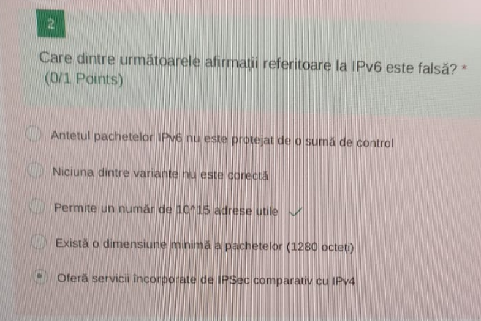
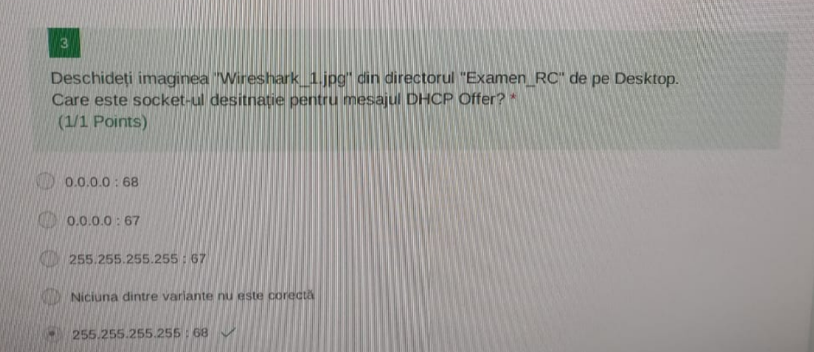
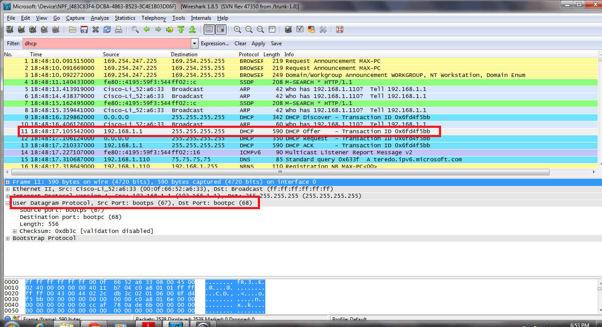
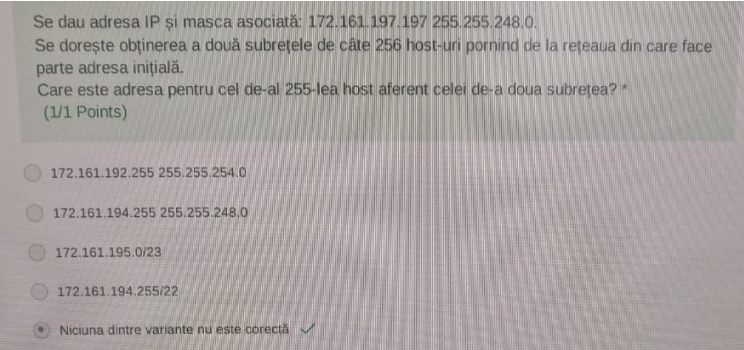

- IPv6 folosește 128 biți, deci numărul de adrese totale este ``2^128``. Din acestea 2 sunt rezervate pentru adresa de rețea și cea de broadcast, deci numărul de adrese utilizabile este ``2^128 - 2``
- O dimensiune minimă a pachetelor există, dar de 40 bytes, deoarece acesta este dimensiunea minimă a unui header IPv6, payload-ul (body) în acest caz fiind de 0 bytes.
- ``IPSec`` este o suită de protocoale folosită pentru a asigura securitatea comunicațiilor prin ``IP``. Ea este construită direct în protocolul IPv6 și oferă aplicațiilor varianta folosirii acesteia. În IPv4 ea poate fi folosită, dar este implicit opțională.
---

- Exemplu de imagine:

---

- După ce am efectuat ȘI logic între adresa IP si masca asociată, aflăm adresa rețelei: ``172.161.192.0/21``. Pentru a continua procesul de subnetare cu mască fixă trebuie să stabilim masca celor două subrețele. 
- Dacă nu am fi avut nicio restricție din punct de vedere al numărului de host-uri, am fi folosit un număr minim de biți pentru identificarea subrețelelor, în acest caz unul singur, deoarece avem doar două subrețele. În acest caz masca ar fi fost ``22``, iar adresele celor două subrețele ``172.161.192.0/22`` respectiv ``172.161.224.0/22``
- Totuși, datorită restricției numărului de host-uri, vom alege masca ``24`` care ne lasă 8 biți pentru partea de host, deci fix ``2^8 = 256`` host-uri. Astfel, prima rețea are adresa ``172.161.192.0/24``, iar cea de a doua ``172.161.193.0/24``, iar cel de-al 255-lea host aferent pentru a doua rețea este ``172.161.193.254/24``
---

- a) Adresa de rețea pentru adresa IP ``192.167.225.19/30`` este ``192.167.225.16/30``, adresa de broadcast fiind chiar ``192.167.225.19/30``, deci comanda nu va funcționa
- c) comanda nu va funcționa pentru ca este adresa de broadcast
- d) comanda nu fa funcționa pentru ca este adresa de rețea