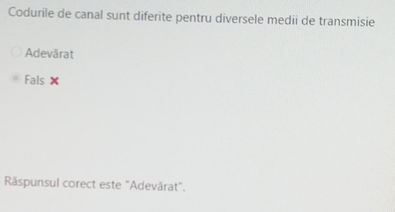

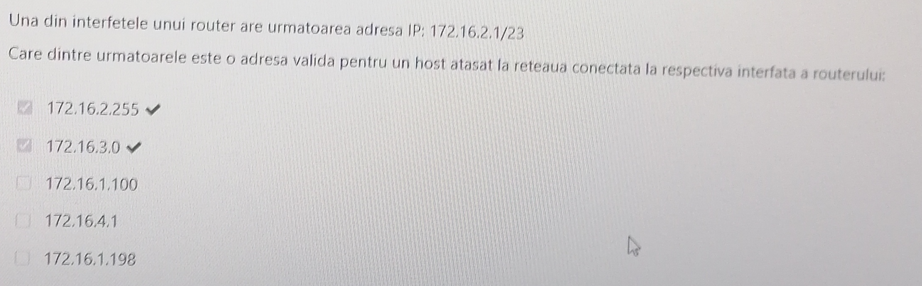

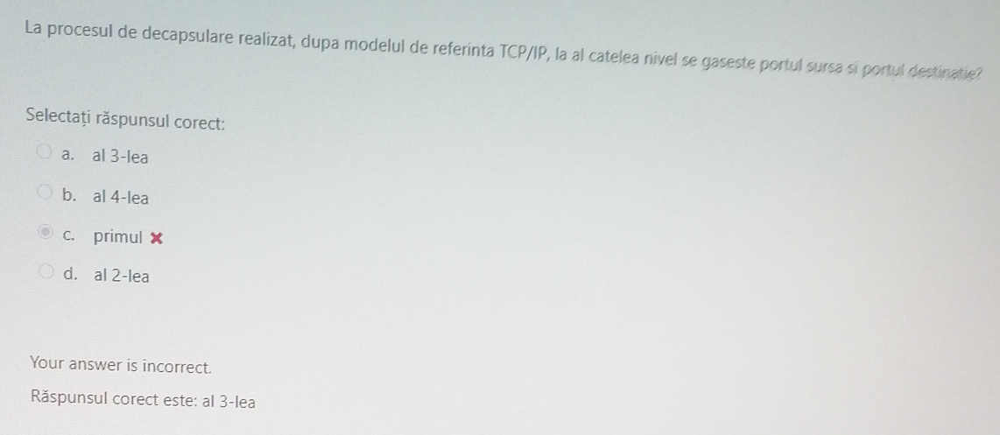

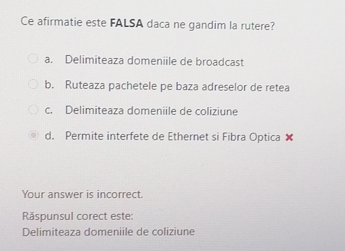

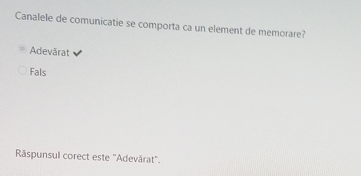

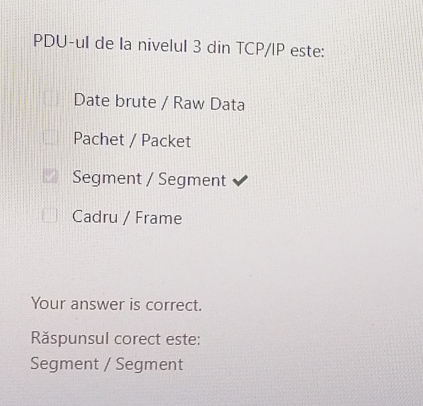
-  Rezumat al PDU-urilor (numaratoarea nivelelor incepe de jos in sus):

| **Nivel TCP/IP**       | **PDU**              |
| ---------------------- | -------------------- |
| 4. Aplicație              | **Date (Data)**      |
| 3. Transport              | **Segment/Datagram** |
| 2. Internet               | **Pachet (Packet)**  |
| 1. Rețea/Legătură de Date | **Cadru (Frame)**    |

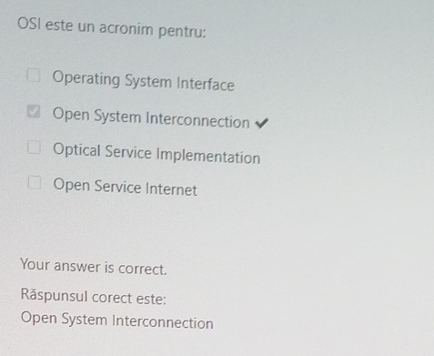

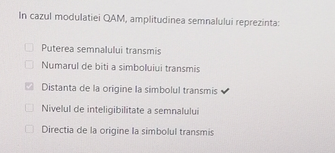

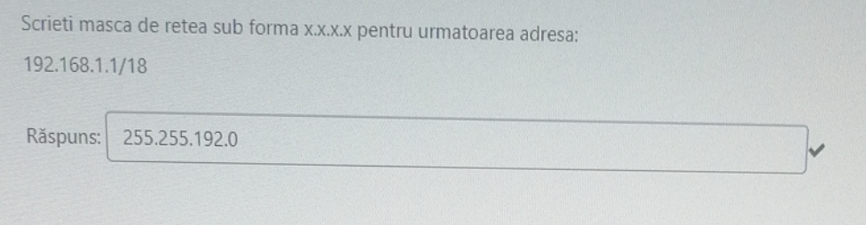
- ``/18`` specifica numarul de biti rezervati pentru retea, restul ramanand pentru gazda => masca de retea este ``11111111.11111111.11000000.00000000`` = ``255.255.192.0``


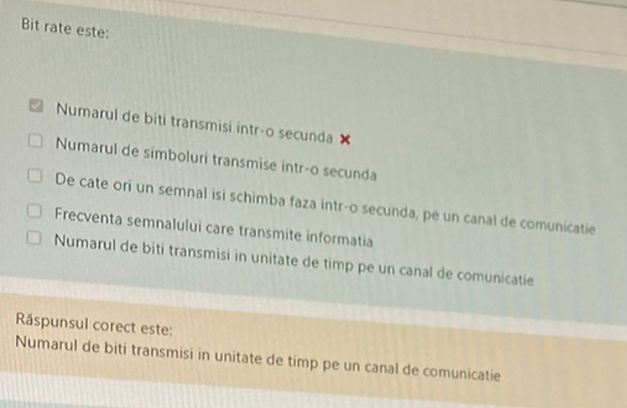

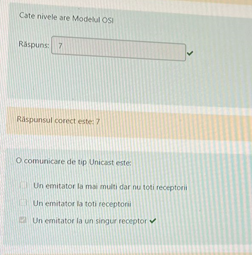

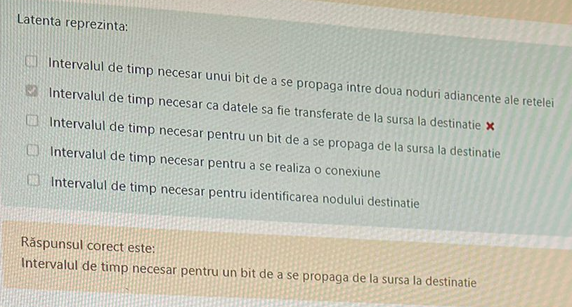

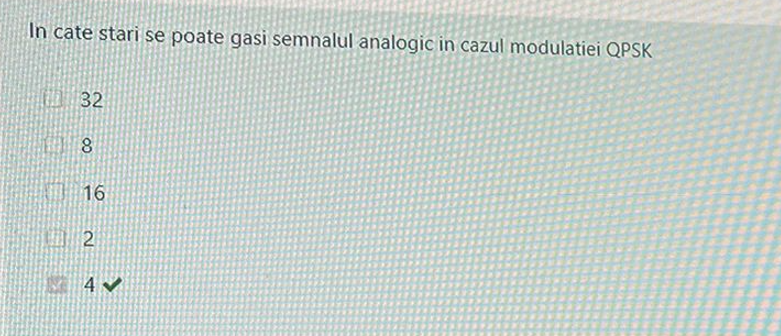

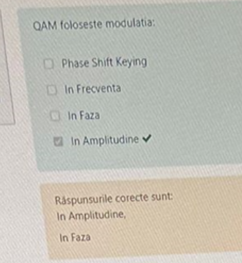

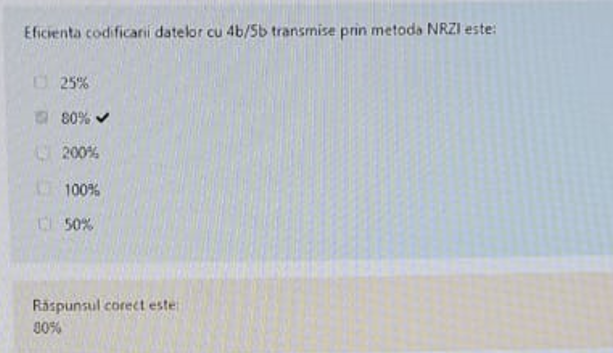

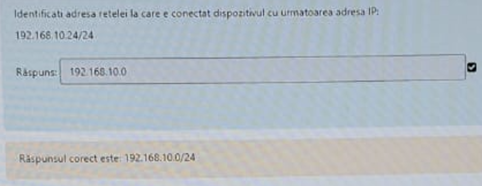
- Numarul de biti rezervati pentru retea este ``24``, deci masca de retea este ``11111111.11111111.11111111.00000000`` = ``255.255.255.0``. Pentru a afla adresa retelei aplicam ``AND`` logic intre masca de retea si adresa IP (pe grupe), deci ``192.168.10.0/24``

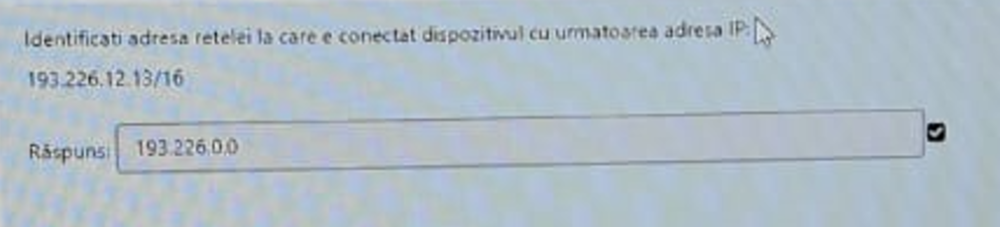

- Masca de retea = ``11111111.11111111.00000000.00000000 = 255.255.0.0 => 193.226.12.13 & 255.255.0.0 = 193.226.0.0``. Raspuns final ``193.226.0.0/16``

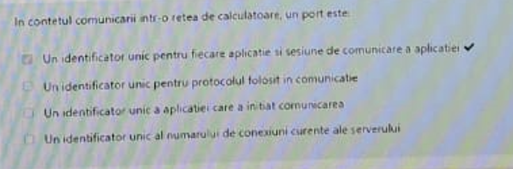

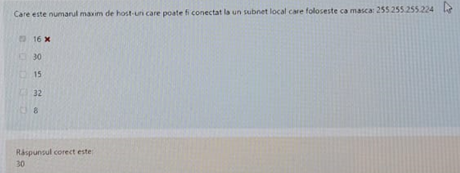
- Masca de retea in binar este ``11111111.11111111.11111111.11100000``, deci avem ``27`` de biti rezervati pentru adresa retelei, iar restul de ``5`` biti sunt rezervati pentru host(gazda). Formula pentru nr de adrese într-un subnet = ``2^n``, unde ``n = nr de biti alocați pt partea de host``, deci avem ``2^5 = 32 host-uri``. Din aceste ``32``, doua sunt rezervate pentru adresa de rețea, prima din rețea și adresa de broadcast, ultima din rețea.  Rezulta ``32 - 2 = 30``
- Prima adresa pentru host este adresa de rețea + 1, iar ultima este adresa de broadcast - 1

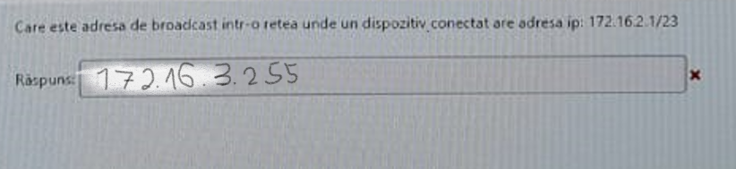
```
Executam 'AND' logic intre masca de retea si adresa ip pt a afla adresa retelei:
Masca retea = 11111111 . 11111111 . 11111110 . 00000000 
Adresa IP   = 10101100 . 00100000 . 00000010 . 00000001 

=> Adresa rețelei = 172 . 16 . 2 . 0 
Pentru a afla adresa de broadcast punem toți biții rezervati pentru gazda pe 1
=> 172.16.3.255
```

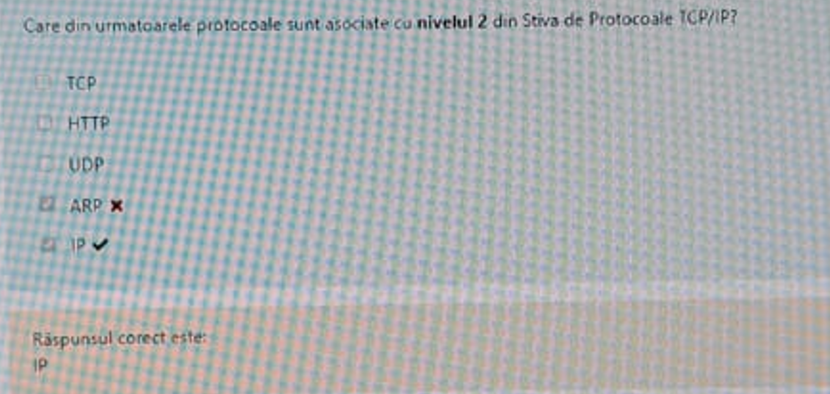

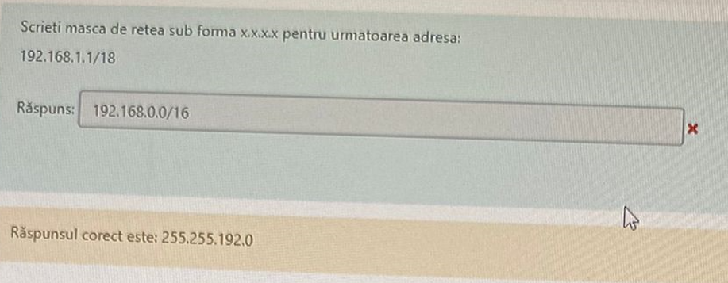
- Masca de retea este formata din ``18`` biti de 1, deci ``11111111.11111111.11000000.00000000`` = ``255.255.192.0``

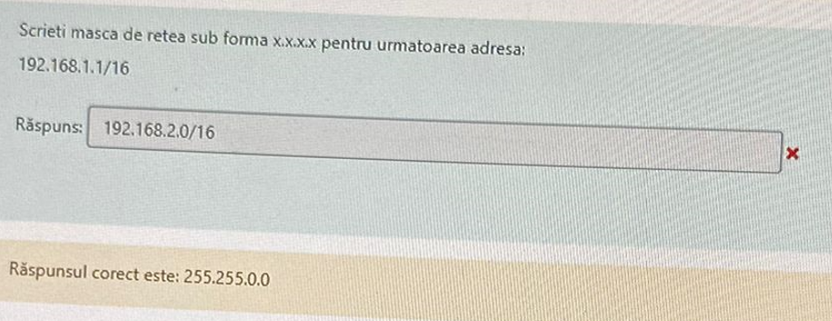
- Masca de retea este formata din ``16`` biti de 1, deci ``11111111.11111111.00000000.00000000`` = ``255.255.0.0``

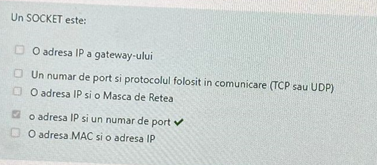

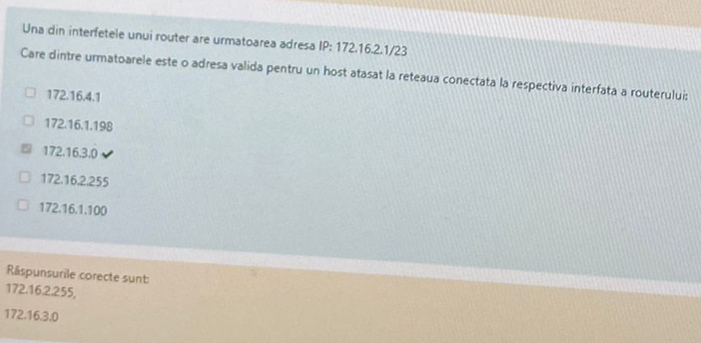

- Avem ``23`` de biti rezervati pentru adresa retelei, deci masca de retea este ``11111111.11111111.11111110.00000000 = 255.255.254.0``
```
Executam 'AND' logic intre masca de retea si adresa IP pentru a afla adresa retelei

172.16.2.1 & 255.255.254.0 = 172.16.2.0

Prima adresa ip = 172.16.2.0 + 1 (9 biti fiind rezervati pentru partea de gazda) = 172.16.3.0

172.16.2.255 este si ea valida, deoarece ultima adresa ip, cea de broadcast, este 172.16.3.255

```


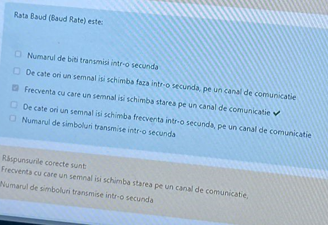

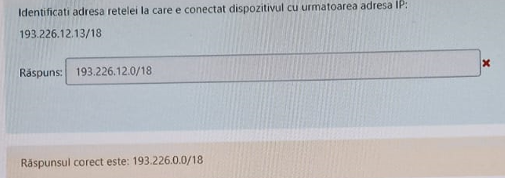
- Nr de biti rezervati pentru retea = ``18`` => masca de retea este ``11111111.11111111.11000000.00000000 = 255.255.192.0``
```
Executam 'AND' logic intre masca de retea si adresa ip pt a afla adresa retelei:
Masca retea = 11111111 . 11111111 . 11000000 . 00000000 
Adresa IP   = 11000001 . 11100010 . 00001100 . 00001101 
=>            11000001 . 11100010 . 00000000 . 00000000 = 192.226.0.0
Raspuns final, 192.226.0.0/18
```

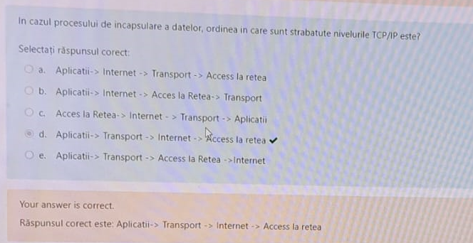

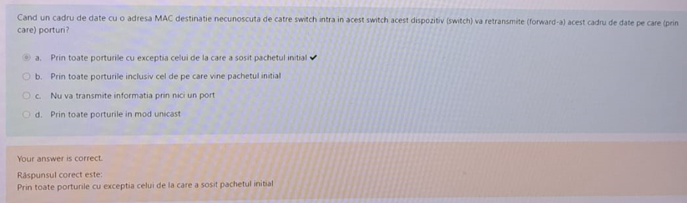

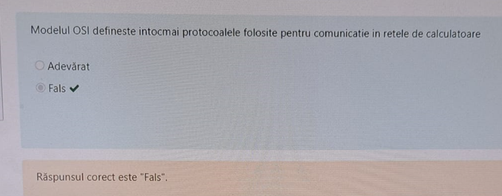

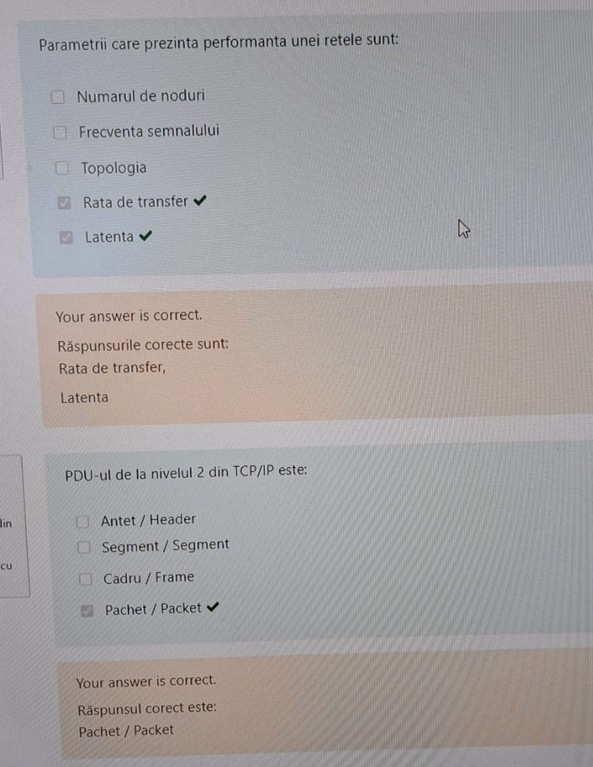
